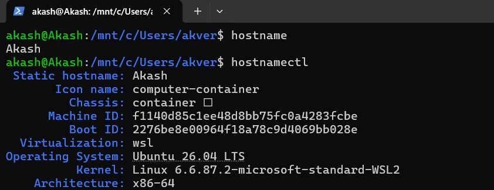
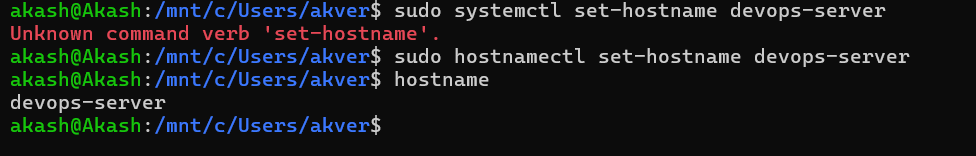
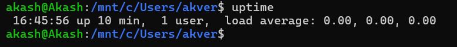
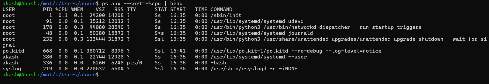
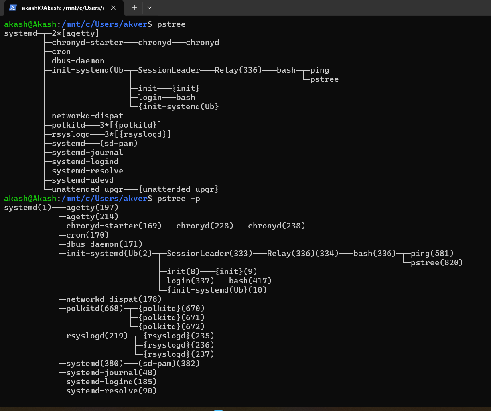
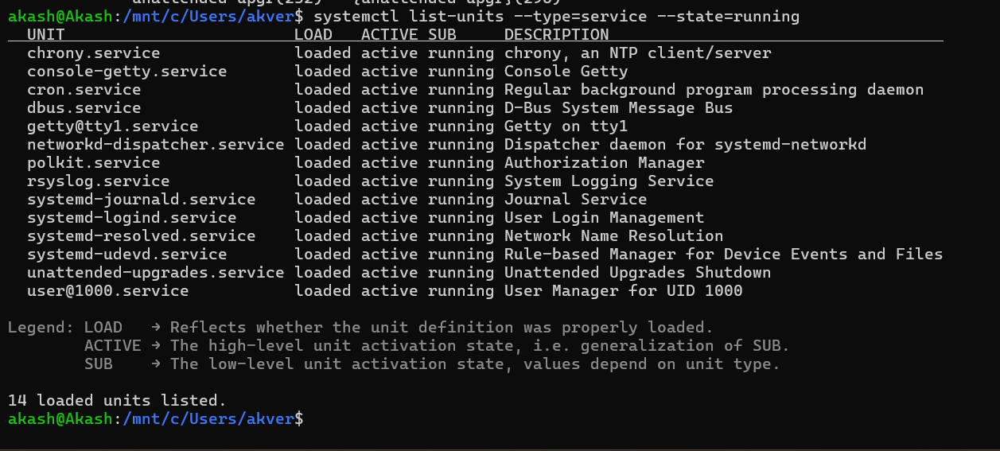
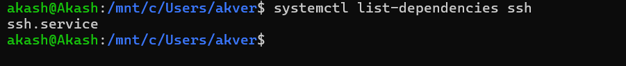
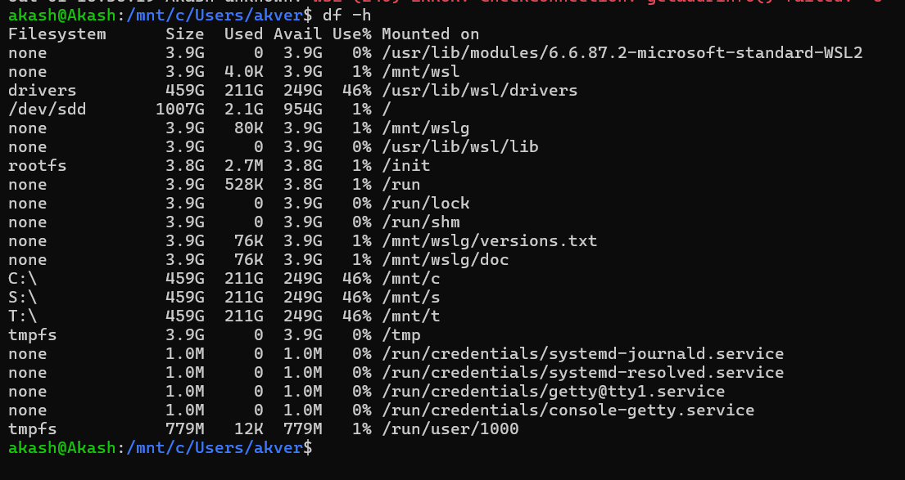

# Day 04 – Linux Processes, Services & Logs

> Part of my **#90DaysOfDevOps** journey 🚀

## 📌 Objective

Today's goal was to understand how Linux manages **processes**, **services**, and **system logs** by using essential command-line tools.

---

## ✅ Tasks Completed

- Ran and recorded output for multiple Linux commands.
- Practiced process management commands.
- Explored system services using `systemctl`.
- Inspected the **SSH** service.
- Viewed system and service logs using `journalctl`.
- Checked filesystem usage.

---

# Hostname Commands

## 1. View Current Hostname

**Command**

```bash
hostnamectl
```



**Purpose**

Displays detailed system information including:
- Hostname
- Operating System
- Kernel Version
- Architecture

---

## 2. Change Hostname

**Command**

```bash
sudo hostnamectl set-hostname devops-server
```



**Purpose**

Changes the system hostname permanently.

---

# Process Commands

## 3. Check System Uptime

**Command**

```bash
uptime
```


**Purpose**

Shows:
- System uptime
- Logged-in users
- Load averages

---

## 4. View High CPU Processes

**Command**

```bash
ps aux --sort=-%cpu | head
```



**Purpose**

Displays the processes consuming the highest CPU.

---

## 5. Display Process Tree

**Command**

```bash
pstree -p
```


**Purpose**

Shows the parent-child relationship between running processes.

---

# Service Commands

## 6. List Running Services

**Command**

```bash
systemctl list-units --type=service --state=running
```




**Purpose**

Lists all currently active system services.

---

## 7. Check SSH Service Status

**Command**

```bash
systemctl status ssh
```

**Purpose**

Displays:
- Current status
- Main PID
- Uptime
- Recent logs

---

## 8. View SSH Dependencies

**Command**

```bash
systemctl list-dependencies ssh
```


**Purpose**

Shows all services and targets required by the SSH service.

---

# Log Commands

## 9. View SSH Logs

**Command**

```bash
journalctl -u ssh -n 20
```

**Purpose**

Displays the latest 20 log entries generated by the SSH service.

---

## 10. View Boot Error Logs

**Command**

```bash
journalctl -p err -b
```

**Purpose**

Shows all error-level messages from the current boot.

---

# Storage Command

## 11. Check Disk Usage

**Command**

```bash
df -h
```



**Purpose**

Displays disk usage in a human-readable format.

---

# 🔍 Service Inspection

### Service Chosen

**SSH (`ssh`)**

Commands Used

```bash
systemctl status ssh
systemctl list-dependencies ssh
journalctl -u ssh -n 20
```

### Observations

- SSH service is active and running.
- Verified service dependencies.
- Reviewed recent SSH logs.
- Learned how systemd manages services.

---

# 📚 Key Learnings

- Learned how Linux manages running processes.
- Used `ps`, `uptime`, and `pstree` for process monitoring.
- Explored system services using `systemctl`.
- Inspected the SSH service and its dependencies.
- Viewed service and system logs using `journalctl`.
- Checked disk usage with `df -h`.
- Changed the system hostname using `hostnamectl`.

---

# 🛠️ Commands Summary

| Category | Command |
|----------|---------|
| Hostname | `hostnamectl` |
| Hostname | `hostnamectl set-hostname` |
| Process | `uptime` |
| Process | `ps aux --sort=-%cpu \| head` |
| Process | `pstree -p` |
| Service | `systemctl list-units --type=service --state=running` |
| Service | `systemctl status ssh` |
| Service | `systemctl list-dependencies ssh` |
| Logs | `journalctl -u ssh -n 20` |
| Logs | `journalctl -p err -b` |
| Storage | `df -h` |

---

## 🚀 Outcome

Today I gained hands-on experience in monitoring Linux processes, managing services with `systemctl`, analyzing logs using `journalctl`, and understanding how Linux systems operate behind the scenes.

---

### #90DaysOfDevOps #Linux #DevOps #AWS #SystemAdministration #CloudComputing