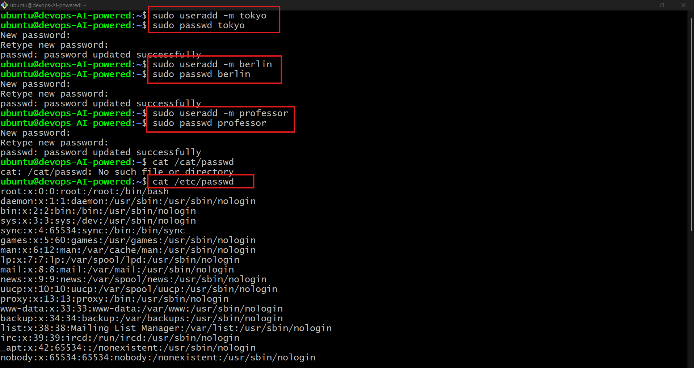
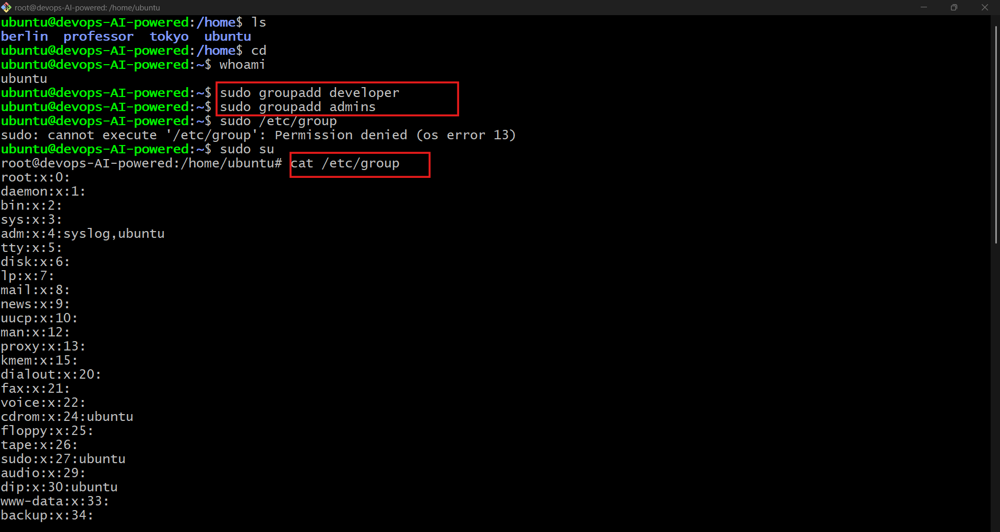
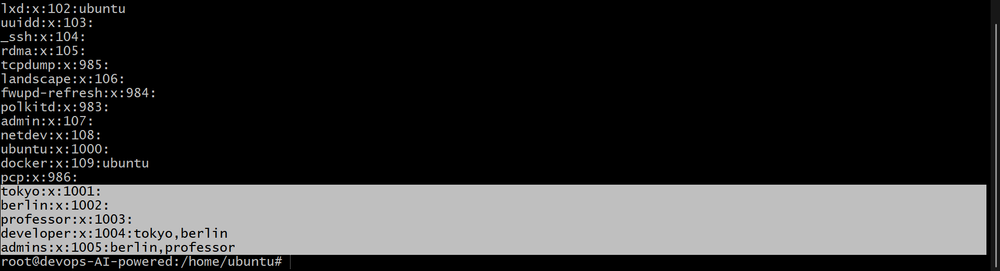
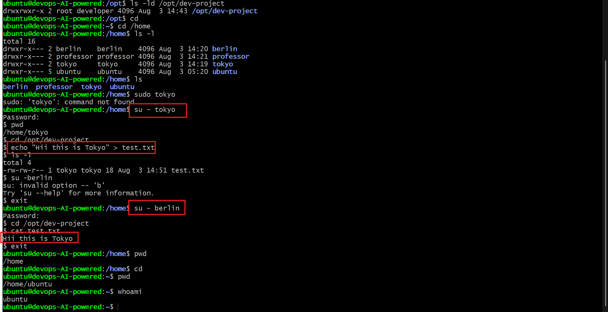
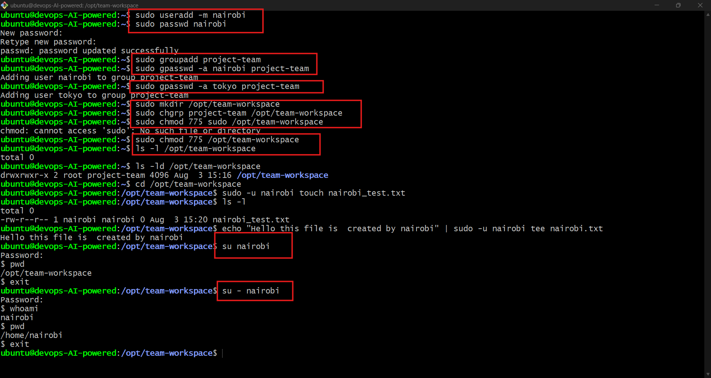

# 🚀 Day 09 – Linux User & Group Management Challenge

## 🎯 Objective
Learn how to create users, manage groups, assign permissions, and build shared workspaces in Linux.

---

# ✅ Task 1 – Create Users

### Commands Used
```bash
sudo useradd -m tokyo
sudo useradd -m berlin
sudo useradd -m professor

sudo passwd tokyo
sudo passwd berlin
sudo passwd professor

cat /etc/passwd
ls /home
```

### 📸 Screenshot



### ✔️ Learned
- Created users with home directories.
- Set passwords for each user.
- Verified users using `/etc/passwd` and `/home`.

---

# ✅ Task 2 – Create Groups

### Commands Used
```bash
sudo groupadd developers
sudo groupadd admins

cat /etc/group
```

### 📸 Screenshot


### ✔️ Learned
- Created new Linux groups.
- Verified groups using `/etc/group`.

---

# ✅ Task 3 – Assign Users to Groups

### Commands Used
```bash
sudo usermod -aG developers tokyo
sudo usermod -aG developers,admins berlin
sudo usermod -aG admins professor

groups tokyo
groups berlin
groups professor
```

### 📸 Screenshot


### ✔️ Learned
- Added users to one or multiple groups.
- Checked group membership using `groups`.

---

# ✅ Task 4 – Shared Directory

### Commands Used
```bash
sudo mkdir -p /opt/dev-project

sudo chgrp developers /opt/dev-project
sudo chmod 775 /opt/dev-project

sudo -u tokyo touch /opt/dev-project/tokyo.txt
sudo -u berlin touch /opt/dev-project/berlin.txt

ls -ld /opt/dev-project
ls -l /opt/dev-project
```

### 📸 Screenshot


### ✔️ Learned
- Assigned a directory to a group.
- Set permissions using `chmod`.
- Tested access with different users.

---

# ✅ Task 5 – Team Workspace

### Commands Used
```bash
sudo useradd -m nairobi
sudo passwd nairobi

sudo groupadd project-team

sudo usermod -aG project-team nairobi
sudo usermod -aG project-team tokyo

sudo mkdir -p /opt/team-workspace

sudo chgrp project-team /opt/team-workspace
sudo chmod 775 /opt/team-workspace

sudo -u nairobi touch /opt/team-workspace/nairobi.txt

ls -ld /opt/team-workspace
ls -l /opt/team-workspace
```

### 📸 Screenshot


### ✔️ Learned
- Created a shared team workspace.
- Allowed group members to collaborate.
- Verified access by creating files.

---

# 📚 Commands Used

```bash
useradd
passwd
groupadd
usermod
groups
mkdir
chgrp
chmod
touch
ls
cat
```

---

# 💡 Key Takeaways

- Linux users and groups help manage system access.
- Group permissions make collaboration easier.
- `chmod` and `chgrp` are essential for controlling shared directories.
- Always verify changes after creating users, groups, or permissions.

---

## 🎉 Day 09 Completed ✅

**Skills Practiced**
- User Management
- Group Management
- File Permissions
- Shared Directory Setup
- Linux Administration Basics