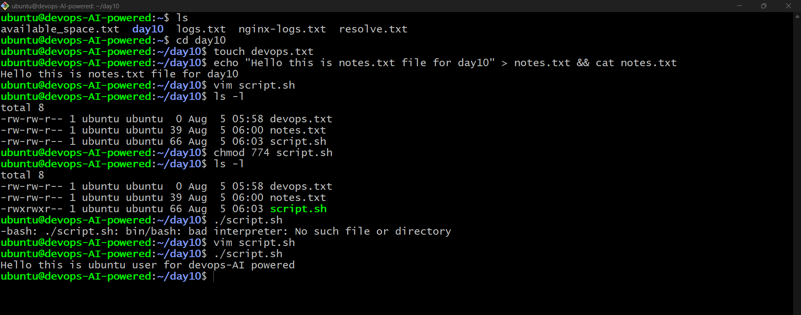
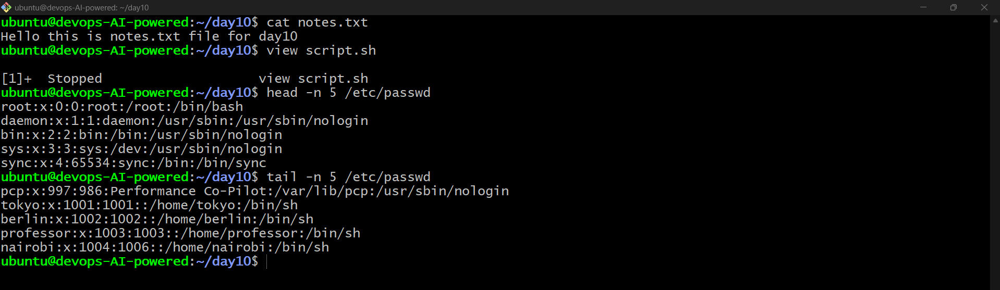
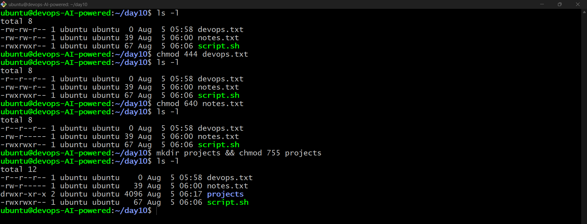
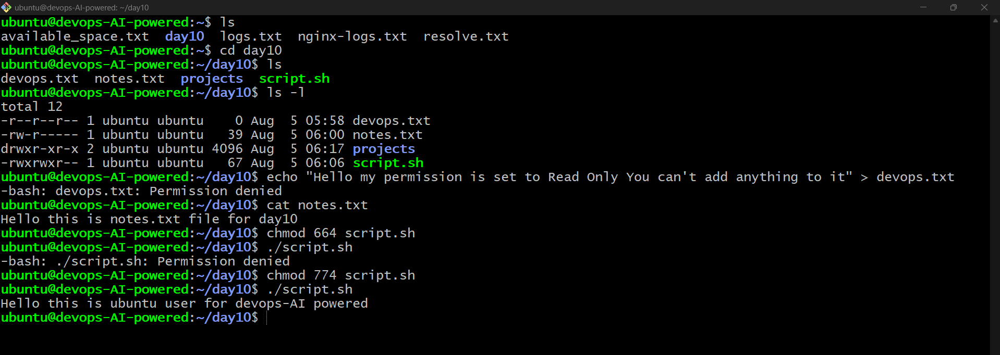

# 🐧 Day 10 – Linux File Permissions & Bash Basics

## 📌 Objective

The goal of this challenge was to understand Linux file management, file permissions, and basic Bash scripting by creating files, reading files, modifying permissions, and testing permission-related behavior.

---

# ✅ Task 1: Create Files

### Commands Used

```bash
touch devops.txt

echo "Hello this is notes.txt file for Day 10" > notes.txt

vim script.sh
```

**script.sh**

```bash
#!/bin/bash
echo "Hello DevOps"
```

Verify files:

```bash
ls -l
```

### Outcome

* Created an empty file `devops.txt`
* Created `notes.txt` with sample content
* Created a Bash script `script.sh`
* Verified file permissions using `ls -l`

### Screenshot

> 

---

# ✅ Task 2: Read Files

### Commands Used

```bash
cat notes.txt

vim -R script.sh

head -n 5 /etc/passwd

tail -n 5 /etc/passwd
```

### Outcome

* Read file contents using `cat`
* Opened a file in Vim read-only mode
* Displayed the first five lines of `/etc/passwd`
* Displayed the last five lines of `/etc/passwd`

### Screenshot

> 

---

# ✅ Task 3: Understand Permissions

### Command Used

```bash
ls -l devops.txt notes.txt script.sh
```

### Linux Permission Format

```text
rwxrwxrwx
```

| Symbol | Meaning | Value |
| ------ | ------- | ----: |
| r      | Read    |     4 |
| w      | Write   |     2 |
| x      | Execute |     1 |

Permission groups:

* **Owner** → First three characters
* **Group** → Middle three characters
* **Others** → Last three characters

### Outcome

* Learned how to interpret Linux file permissions
* Identified which users can read, write, and execute files

---

# ✅ Task 4: Modify Permissions

### Commands Used

```bash
chmod +x script.sh

./script.sh

chmod a-w devops.txt

chmod 640 notes.txt

mkdir project

chmod 755 project

ls -l

ls -ld project
```

### Outcome

* Made `script.sh` executable
* Changed `devops.txt` to read-only
* Set `notes.txt` permissions to **640**
* Created a directory with **755** permissions
* Verified permission changes

### Screenshot

> 

---

# ✅ Task 5: Test Permissions

### Commands Used

```bash
echo "Testing" >> devops.txt

chmod -x script.sh

./script.sh
```

### Expected Errors

Attempting to write to a read-only file:

```text
Permission denied
```

Attempting to execute a file without execute permission:

```text
Permission denied
```

### Outcome

* Tested Linux permission restrictions
* Observed how Linux enforces file access and execution rules

### Screenshot

> 

---

# 🎯 Key Learnings

* Created and managed files using Linux commands
* Read files using `cat`, `head`, `tail`, and Vim
* Understood Linux file permissions (`rwxrwxrwx`)
* Modified permissions using `chmod`
* Executed Bash scripts
* Tested permission restrictions and interpreted system error messages

---

# 📚 Commands Practiced

```bash
touch
echo
cat
vim
head
tail
ls -l
chmod
mkdir
./script.sh
```

---

# 🚀 Conclusion

This challenge strengthened my understanding of Linux file management, permissions, and Bash scripting fundamentals. These concepts are essential for system administration and form a strong foundation for DevOps automation and security.

---

## 👨‍💻 Author

**Akash Verma**

---

**#90DaysOfDevOps #Linux #DevOps #Bash #LinuxPermissions #OpenSource #LearningInPublic**
