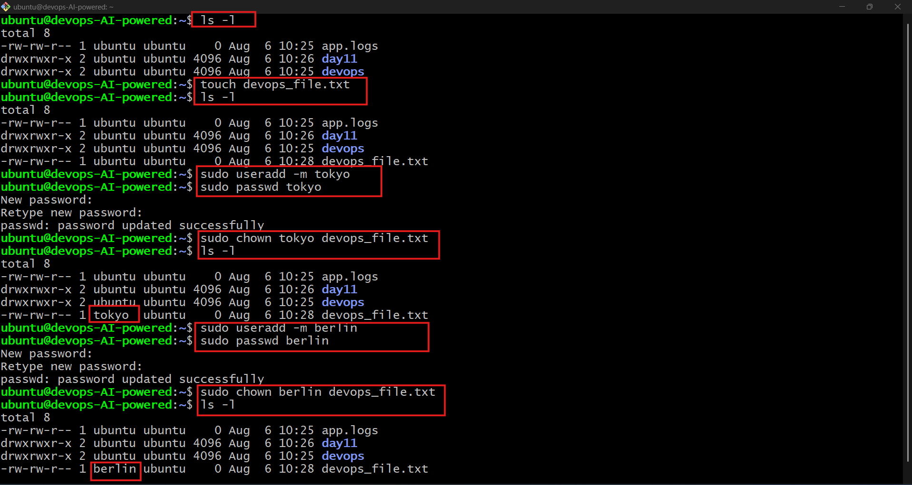
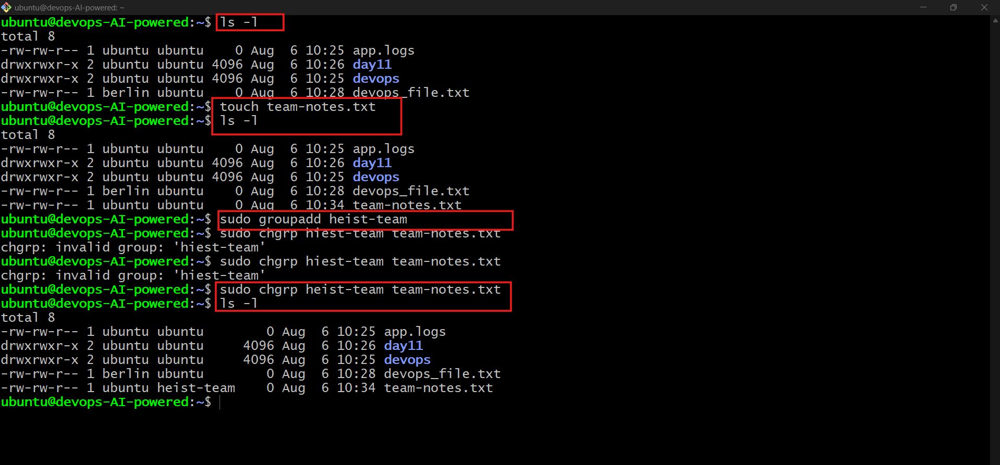
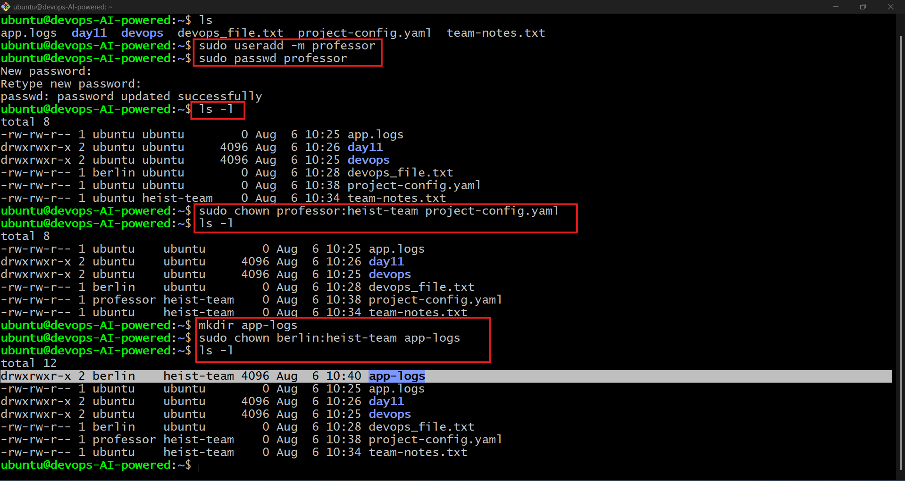
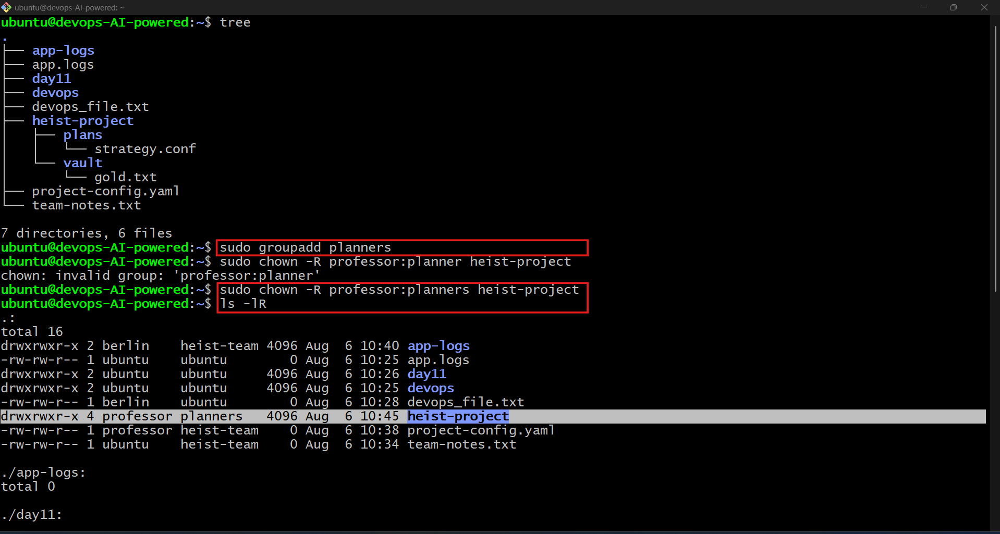
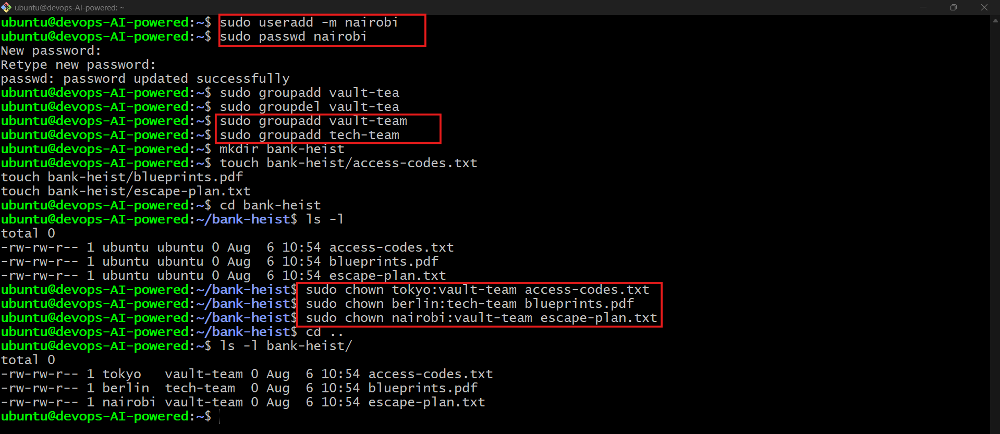

# 🐧 Day 11 – Linux File Ownership (`chown` & `chgrp`)

## 📌 Objective

Learn how Linux file ownership works by managing **users**, **groups**, and **permissions** using `chown` and `chgrp`.

---

# ✅ Task 1: Understanding File Ownership

Checked the owner and group of files using:

```bash
ls -l
```

**Observation:**

* **Owner** → User who owns the file.
* **Group** → Users in the same group who can access the file based on permissions.

---

# ✅ Task 2: Basic `chown` Operations

Created a file:

```bash
touch devops-file.txt
```

Checked current ownership:

```bash
ls -l devops-file.txt
```

Changed file owner:

```bash
sudo chown tokyo devops-file.txt
sudo chown berlin devops-file.txt
```

Verified the changes:

```bash
ls -l devops-file.txt
```

### 📷 Output

> ### 📷 Screenshot



---

# ✅ Task 3: Basic `chgrp` Operations

Created a file:

```bash
touch team-notes.txt
```

Created a new group:

```bash
sudo groupadd heist-team
```

Changed the file group:

```bash
sudo chgrp heist-team team-notes.txt
```

Verified:

```bash
ls -l team-notes.txt
```

### 📷 Output

> ### 📷 Screenshot



---

# ✅ Task 4: Change Owner & Group Together

Created a file and directory:

```bash
touch project-config.yaml
mkdir app-logs
```

Changed owner and group in one command:

```bash
sudo chown professor:heist-team project-config.yaml
sudo chown berlin:heist-team app-logs
```

Verified:

```bash
ls -ld app-logs
ls -l project-config.yaml
```

### 📷 Output

> ### 📷 Screenshot



---

# ✅ Task 5: Recursive Ownership

Created the project structure:

```bash
mkdir -p heist-project/vault
mkdir -p heist-project/plans

touch heist-project/vault/gold.txt
touch heist-project/plans/strategy.conf
```

Created a group:

```bash
sudo groupadd planners
```

Changed ownership recursively:

```bash
sudo chown -R professor:planners heist-project/
```

Verified:

```bash
ls -lR heist-project/
```

### 📷 Output

> ### 📷 Screenshot



---

# ✅ Task 6: Practice Challenge

Created users:

```bash
sudo useradd tokyo
sudo useradd berlin
sudo useradd nairobi
```

Created groups:

```bash
sudo groupadd vault-team
sudo groupadd tech-team
```

Created project directory and files:

```bash
mkdir bank-heist

touch bank-heist/access-codes.txt
touch bank-heist/blueprints.pdf
touch bank-heist/escape-plan.txt
```

Assigned ownership:

```bash
sudo chown tokyo:vault-team bank-heist/access-codes.txt

sudo chown berlin:tech-team bank-heist/blueprints.pdf

sudo chown nairobi:vault-team bank-heist/escape-plan.txt
```

Verified:

```bash
ls -l bank-heist/
```

### 📷 Output

> ### 📷 Screenshot



---

# 🎯 Key Commands Learned

| Command             | Purpose                                 |
| ------------------- | --------------------------------------- |
| `ls -l`             | View file owner, group, and permissions |
| `chown`             | Change file owner                       |
| `chgrp`             | Change file group                       |
| `chown owner:group` | Change owner and group together         |
| `chown -R`          | Recursively change ownership            |
| `groupadd`          | Create a new group                      |
| `useradd`           | Create a new user                       |

---

# 📚 Key Takeaways

* Every file in Linux has an **owner** and a **group**.
* `chown` is used to change the file owner.
* `chgrp` changes the associated group.
* `chown owner:group` updates both owner and group in one command.
* The `-R` option applies ownership changes recursively to directories and their contents.

---

## 🚀 Day 11 Completed Successfully

Successfully practiced Linux file ownership management using `chown`, `chgrp`, users, groups, and recursive ownership changes.
