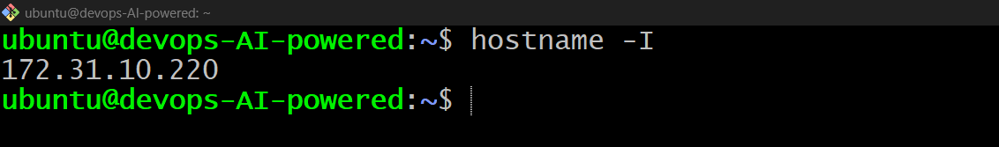
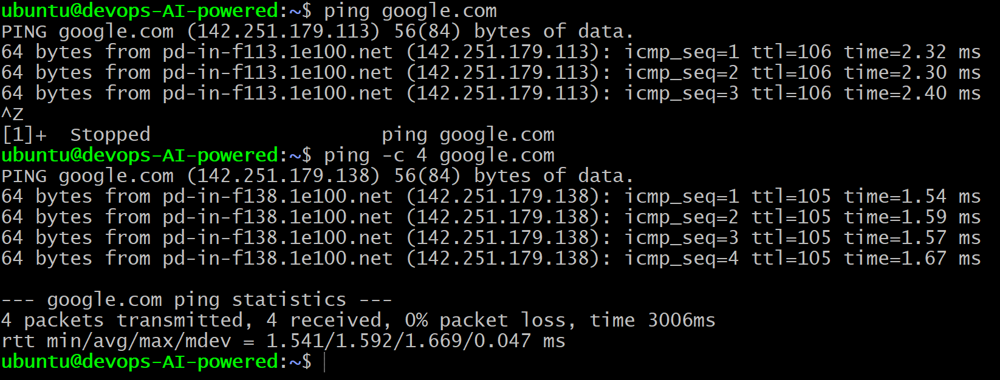
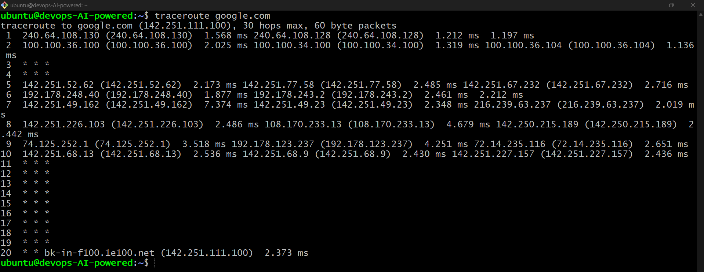
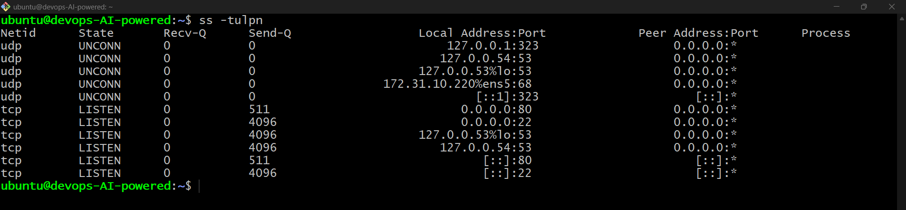
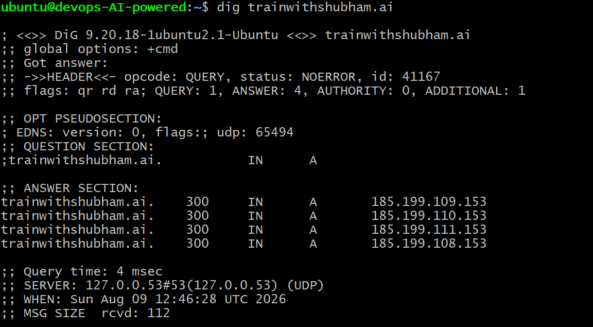
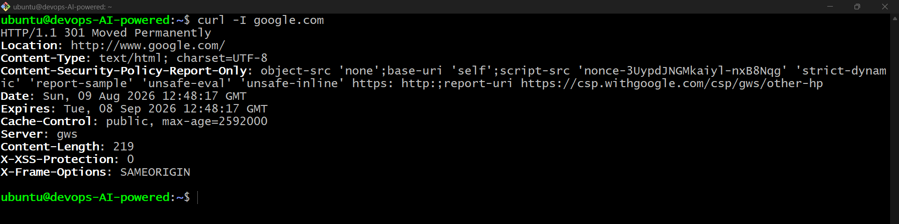
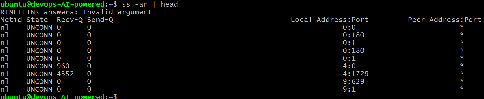
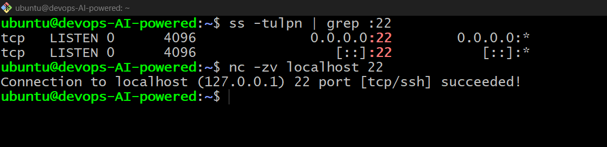

# 🐧 Day 14 – Networking Fundamentals & Hands-on Checks

## 🎯 Objective

Learn basic networking concepts and practice essential Linux networking commands used for troubleshooting.

---

## 1️⃣ OSI vs TCP/IP Models

### Quick Notes

* **OSI:** 7 layers — Physical, Data Link, Network, Transport, Session, Presentation, Application.
* **TCP/IP:** 4 layers — Link, Internet, Transport, Application.
* **IP** → Network/Internet layer
* **TCP/UDP** → Transport layer
* **HTTP/HTTPS/DNS** → Application layer

Example:

```bash
curl https://example.com
```

➡️ Application → TCP → IP → Network


---

## 2️⃣ Check IP Address

```bash
hostname -I
```

Shows the IP address assigned to the machine.

📸 **Screenshot:**
> 

---

## 3️⃣ Test Reachability

```bash
ping google.com
```

Checks whether the target is reachable and shows latency/packet loss.

📸 **Screenshot:**
> 

---

## 4️⃣ Trace Network Path

```bash
traceroute google.com
```

Shows the network hops between the local machine and the destination.

📸 **Screenshot:**
> 

---

## 5️⃣ Check Listening Ports

```bash
ss -tulpn
```

Displays listening TCP/UDP ports and their associated services.

**Example:** SSH → Port `22`

📸 **Screenshot:**
> 

---

## 6️⃣ DNS Lookup

```bash
dig google.com
```

Resolves a domain name into its IP address.

📸 **Screenshot:**
> 

---

## 7️⃣ HTTP Check

```bash
curl -I https://example.com
```

Checks HTTP response headers and status code.

**Example:** `200 OK`

📸 **Screenshot:**
> 

---

## 8️⃣ Connections Snapshot

```bash
netstat -an | head
```

Shows active network connections and their states such as `ESTABLISHED` and `LISTEN`.

📸 **Screenshot:**
> 

---

## 9️⃣ Port Probe

First identify a listening port:

```bash
ss -tulpn
```

Then test it:

```bash
nc -zv localhost <PORT>
```

If successful, the port is reachable. If not, check the service status, firewall, and configuration.

📸 **Screenshot:**
> 

---


## Mini Task: Port Probe & Interpret

> 

---


## 🧠 Reflection

### Fastest troubleshooting commands

```bash
ping <target>
curl -I <URL>
```

### If DNS fails

Check the **Application layer** and verify DNS configuration using:

```bash
dig <domain>
```

### If HTTP 500 occurs

Check:

* Application logs
* Web server logs
* Service status

### Follow-up checks

1. Check service status and logs.
2. Check ports and firewall rules.

---

## ✅ Key Takeaways

* Understood **OSI & TCP/IP models**
* Practiced **IP, ping, traceroute, ports and DNS**
* Tested **HTTP connectivity**
* Practiced **port probing**
* Learned a basic **network troubleshooting workflow**

# 🚀 Day 14 Completed!

**90 Days of DevOps | Networking Fundamentals & Hands-on Checks 🐧**
