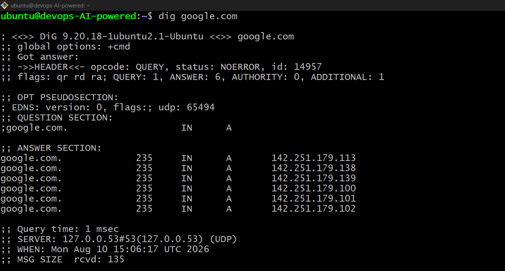
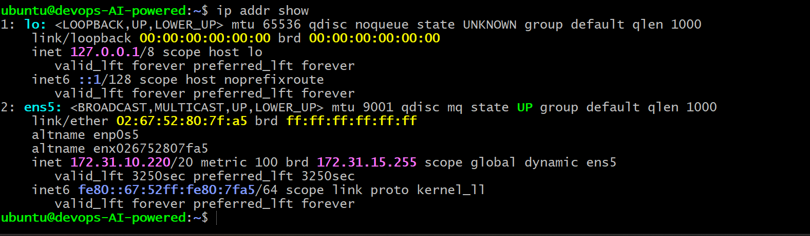
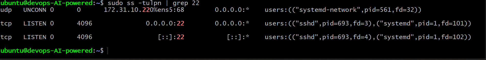

# Day 15 – Networking Concepts: DNS, IP, Subnets & Ports

## 📌 Overview

Today I learned the basic networking concepts that are important for a DevOps engineer: **DNS, IP addressing, CIDR/subnetting, and ports**.

---

## 🔹 Task 1: DNS – How Names Become IPs

**Theory:** DNS (Domain Name System) converts a domain name like `google.com` into an IP address that computers can communicate with.

### What happens when you type `google.com`?

1. The browser checks its DNS cache.
2. A DNS resolver looks for the domain's IP address.
3. DNS returns the IP address to the browser.
4. The browser connects to that IP and loads the website.

### DNS Record Types

| Record    | Purpose                                               |
| --------- | ----------------------------------------------------- |
| **A**     | Maps a domain name to an IPv4 address.                |
| **AAAA**  | Maps a domain name to an IPv6 address.                |
| **CNAME** | Creates an alias for another domain name.             |
| **MX**    | Specifies mail servers for a domain.                  |
| **NS**    | Specifies the authoritative DNS servers for a domain. |

### 🔧 Command Used

```bash
dig google.com
```

**A Record:** `<Returns the IPv4 address: 142.251.179.113>`
**TTL:** `<268 seconds>`

📸 **Screenshot – `dig google.com` output**

> 

---

## 🔹 Task 2: IP Addressing

**Theory:** An IP address uniquely identifies a device/interface on a network so that data can be sent to the correct destination.

### IPv4

IPv4 uses **32 bits**, divided into four octets.

Example:

```text
192.168.1.10
```

### Public vs Private IP

| Type           | Description                            | Example        |
| -------------- | -------------------------------------- | -------------- |
| **Public IP**  | Used to communicate over the Internet. | `8.8.8.8`      |
| **Private IP** | Used inside local/private networks.    | `192.168.1.10` |

### Private IPv4 Ranges

```text
10.0.0.0/8
172.16.0.0/12
192.168.0.0/16
```

### 🔧 Command Used

```bash
ip addr show
```

**My Private IP:** `<172.31.10.220/20>`

📸 **Screenshot – `ip addr show` output**

> 

---

## 🔹 Task 3: CIDR & Subnetting

**Theory:** CIDR notation tells us how many bits belong to the network portion of an IP address.

For example:

```text
192.168.1.0/24
```

`/24` means **24 bits are used for the network**, leaving 8 bits for hosts.

### CIDR Table

| CIDR  | Subnet Mask       | Total IPs | Usable Hosts |
| ----- | ----------------- | --------: | -----------: |
| `/24` | `255.255.255.0`   |       256 |          254 |
| `/16` | `255.255.0.0`     |    65,536 |       65,534 |
| `/28` | `255.255.255.240` |        16 |           14 |

**Why do we subnet?**
Subnetting divides a large network into smaller networks for better organization, security, and efficient IP usage.

---

## 🔹 Task 4: Ports – The Doors to Services

**Theory:** A port is a logical number used to identify a specific network service running on a device.

### Common Ports

|    Port | Service |
| ------: | ------- |
|    `22` | SSH     |
|    `80` | HTTP    |
|   `443` | HTTPS   |
|    `53` | DNS     |
|  `3306` | MySQL   |
|  `6379` | Redis   |
| `27017` | MongoDB |

### 🔧 Command Used

```bash
ss -tulpn
```

**Listening services identified:**

* Port `<22>` → `<SSH>`

```bash

sudo ss -tulpn | grep 22

```
📸 **Screenshot – `ss -tulpn` output**

> 


---

## 🔹 Task 5: Putting It Together

### 1. `curl http://myapp.com:8080`

**Theory:** DNS resolves `myapp.com` to an IP, port `8080` identifies the application service, and HTTP is used to communicate with it.

### 2. App can't reach `10.0.1.50:3306`

**Theory:** First check DNS/IP connectivity, network routes, firewall/security rules, and whether MySQL is actually listening on port `3306`.

---

## 📚 What I Learned

1. **DNS** converts domain names into IP addresses.
2. **CIDR and subnetting** help divide and manage networks efficiently.
3. **Ports** identify the services running on a machine.

---

## 🛠️ Commands Practiced

```bash
dig google.com
ip addr show
ss -tulpn
```


**Day 15 completed! 🚀**

#90DaysOfDevOps #DevOps #Networking #Linux #DNS #AWS #Cloud #LearningInPublic
