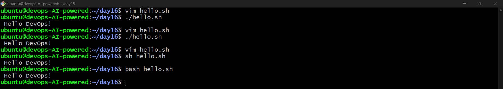
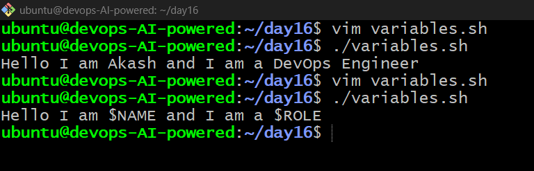
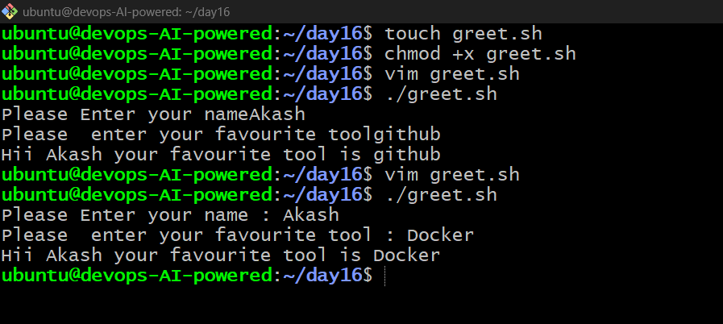
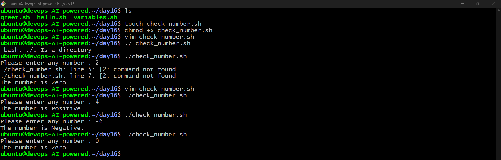
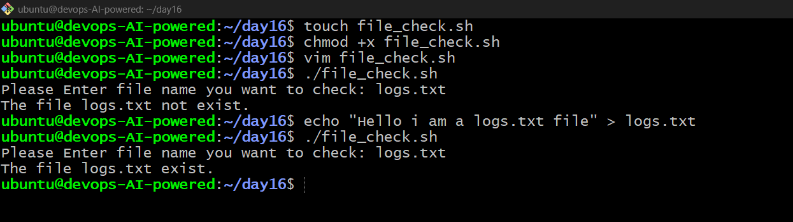
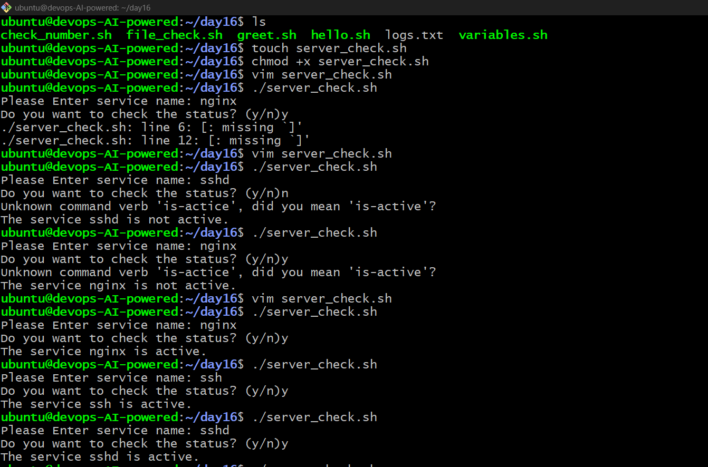

# Day 16 -- Shell Scripting Basics

## Task 1 -- First Script

**Script:** `hello.sh`

``` bash
#!/bin/bash
echo "Hello, DevOps!"
```

**Output:**

``` text
Hello, DevOps!
```

**Note:** The shebang tells Linux which interpreter should run the
script.

**Screenshot:**\
> 

------------------------------------------------------------------------

## Task 2 -- Variables

**Script:** `variables.sh`

``` bash
#!/bin/bash
NAME="Akash"
ROLE="DevOps Engineer"

echo "Hello, I am $NAME and I am a $ROLE"
```

**Output:**

``` text
Hello, I am Akash and I am a DevOps Engineer
```

**Note:** Double quotes expand variables, while single quotes print them
literally.

**Screenshot:**\
> 

------------------------------------------------------------------------

## Task 3 -- User Input

**Script:** `greet.sh`

``` bash
#!/bin/bash
read -p "Enter your name: " name
read -p "Enter your favourite tool: " tool

echo "Hello $name, your favourite tool is $tool"
```

**Output:**

``` text
Hello Akash, your favourite tool is Docker
```

**Note:** `read` is used to take input from the user.

**Screenshot:**\
> 

------------------------------------------------------------------------

## Task 4 -- If-Else Conditions

### `check_number.sh`

``` bash
#!/bin/bash
read -p "Enter a number: " num

if [ $num -gt 0 ]; then
    echo "Positive"
elif [ $num -lt 0 ]; then
    echo "Negative"
else
    echo "Zero"
fi
```

**Note:** `if-elif-else` allows a script to make decisions.

**Screenshot:**\
> 

### `file_check.sh`

``` bash
#!/bin/bash
read -p "Enter filename: " file

if [ -f "$file" ]; then
    echo "File exists."
else
    echo "File does not exist."
fi
```

**Note:** `-f` checks whether a regular file exists.

**Screenshot:**\
> 

------------------------------------------------------------------------

## Task 5 -- Combine It All

### `server_check.sh`

``` bash
#!/bin/bash

read -p "Please Enter service name: " service
read -p "Do you want to check the status? (y/n) " choice

if [ "$choice" = "y" ]; then
    if systemctl is-active "$service" > /dev/null; then
        echo "The service $service is active."
    else
        echo "The service $service is not active."
    fi
elif [ "$choice" = "n" ]; then
    echo "Skipped."
else
    echo "Invalid choice."
fi
```

**Output:**

``` text
Please Enter service name: nginx
Do you want to check the status? (y/n) y
The service nginx is active.
```

**Note:** This combines variables, user input, conditions, and
`systemctl`.

**Screenshot:**\
> 

------------------------------------------------------------------------

## What I Learned

1.  **Shebang** -- Defines the interpreter used to execute a script.
2.  **Variables & read** -- Store values and take user input.
3.  **Conditions** -- Use `if-else` to make decisions in scripts.

## Day 16 Completed ✅
