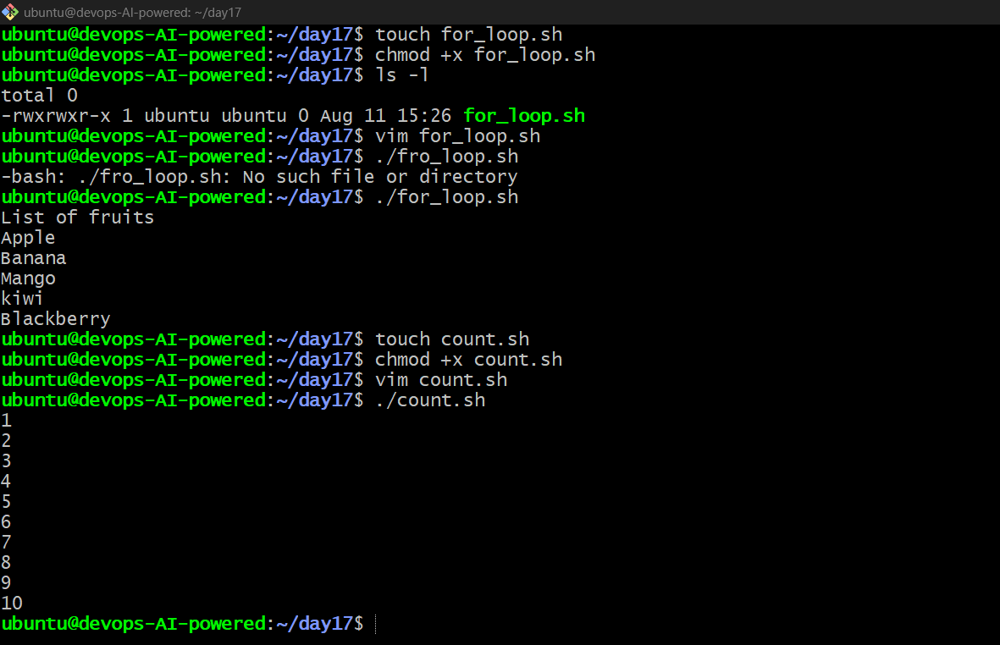
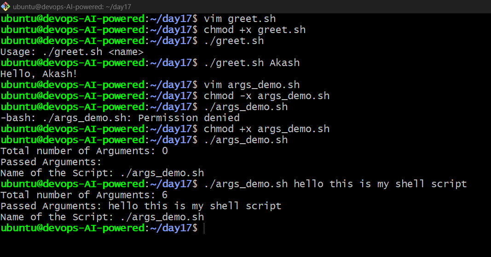
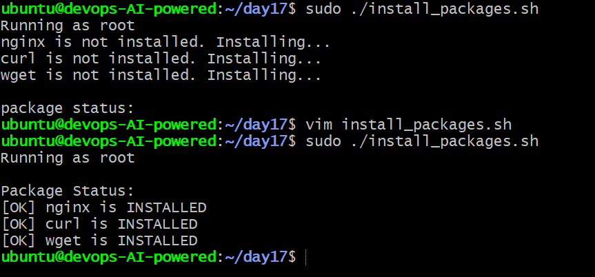
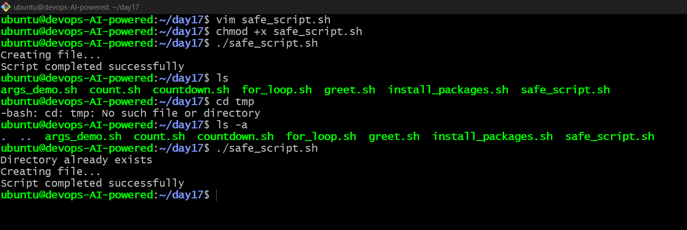

# Day 17 – Shell Scripting: Loops, Arguments & Error Handling

## 📌 Overview

Day 17 of the **#90DaysOfDevOps** challenge focused on improving my Bash scripting skills through loops, command-line arguments, package automation, and error handling.

The goal was to understand how shell scripts can automate repetitive DevOps tasks and handle common execution scenarios.

---

## 🎯 Tasks Completed

### 1️⃣ For Loop

Created:

* `for_loop.sh` – Iterates through a list of 5 fruits.
* `count.sh` – Prints numbers from 1 to 10 using a `for` loop.

**Concepts practiced:**

* `for` loops
* Arrays
* Iteration
* Basic Bash syntax

### 📸 Screenshot

> 

---

### 2️⃣ While Loop

Created:

* `countdown.sh` – Takes a number as input and counts down to `0`, followed by `Done!`.

**Concepts practiced:**

* `while` loops
* User input using `read`
* Conditional expressions
* Arithmetic operations

### 📸 Screenshot

> 

---

### 3️⃣ Command-Line Arguments

Created:

* `greet.sh` – Accepts a name using `$1`.
* `args_demo.sh` – Demonstrates `$0`, `$#`, and `$@`.

**Concepts practiced:**

| Variable | Purpose             |
| -------- | ------------------- |
| `$0`     | Script name         |
| `$1`     | First argument      |
| `$#`     | Number of arguments |
| `$@`     | All arguments       |

The scripts were also tested with and without arguments to understand input validation.

### 📸 Screenshot

> 

---

### 4️⃣ Install Packages via Script

Created:

* `install_packages.sh`

The script automates installation of:

* `nginx`
* `curl`
* `wget`

It checks whether each package is already installed and installs only the missing packages.

The script also verifies that it is being executed with **root privileges**.

### 📸 Screenshot

> 

---

### 5️⃣ Error Handling

Created:

* `safe_script.sh`

Practiced basic Bash error handling using:

* `set -e`
* `||`
* Exit status checking
* Directory and file creation validation

I also added root-user validation to `install_packages.sh` to prevent permission-related execution errors.

### 📸 Screenshot

> 

---

## 🧠 What I Learned

1. **Loops** can automate repetitive operations efficiently.
2. **Command-line arguments** make scripts flexible and reusable.
3. **Error handling and validation** make automation scripts safer and more reliable.

---

## 🚀 Key Takeaway

Day 17 was a practical step toward **DevOps automation with Bash**. I learned how to combine loops, arguments, package management, and error handling to create scripts that are more reusable and reliable.

**Day 17 Completed ✅**

> Learn → Practice → Automate → Improve 🚀

**#90DaysOfDevOps #DevOps #Linux #Bash #ShellScripting #Automation #AWS #CloudComputing**
