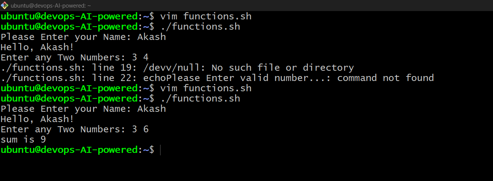
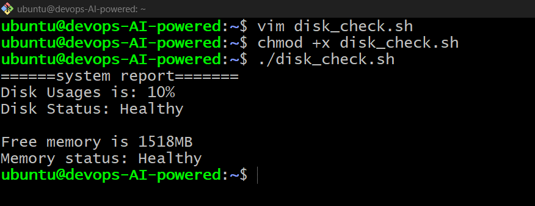
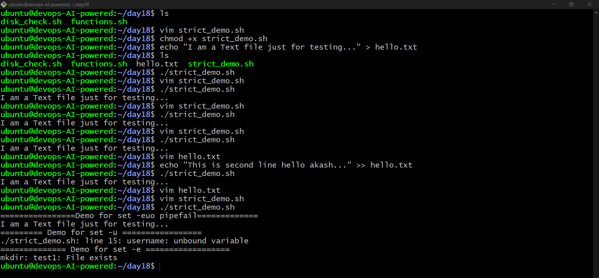
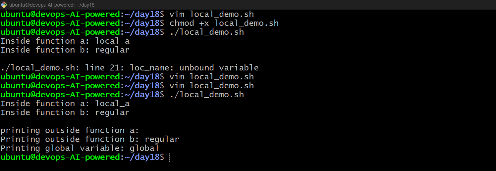
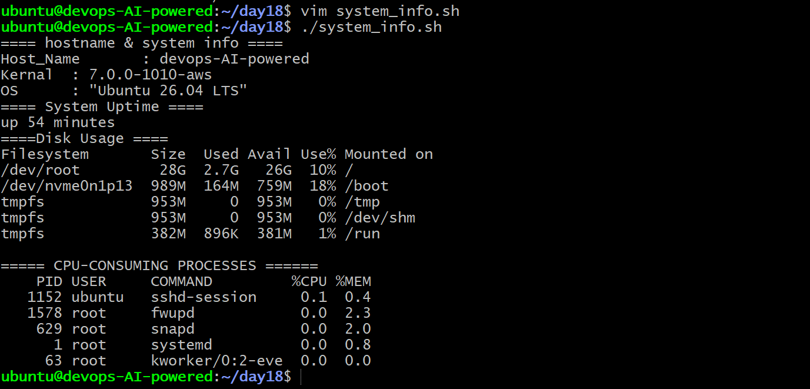

# Day 18 – Shell Scripting: Functions & Slightly Advanced Concepts

---

## Task 1: Basic Functions

Created `functions.sh` to practice creating and calling Bash functions.

The script includes:

- A `greet` function that takes a name as an argument and prints `Hello, <name>!`
- An `add` function that takes two numbers and prints their sum
- Calling both functions from the script

### Output

> 

---

## Task 2: Functions with Return Values

Created `disk_check.sh` to practice using functions for system monitoring.

The script includes:

- A `check_disk` function that checks disk usage of `/`
- A `check_memory` function that checks available memory
- A main section that calls both functions and displays the results

### Output

> 

---

## Task 3: Strict Mode — `set -euo pipefail`

Created `strict_demo.sh` to understand Bash strict mode.

The script demonstrates:

- Undefined variables using `set -u`
- Failed commands using `set -e`
- Failed pipelines using `set -o pipefail`

### What does each flag do?

- `set -e` → Exit immediately if a command fails.
- `set -u` → Exit if an undefined variable is used.
- `set -o pipefail` → Makes a pipeline fail if any command in the pipeline fails.


### Output

> 

---

## Task 4: Local Variables

Created `local_demo.sh` to understand variable scope inside Bash functions.

The script demonstrates:

- Using the `local` keyword for variables
- How local variables stay inside a function
- The difference between local and regular variables
- How variables can behave outside their function scope

### Output

> 

---

## Task 5: Build a Script — System Info Reporter

Created `system_info.sh` as an intermediate Bash scripting project.

The script uses separate functions to display:

1. Hostname and OS information
2. System uptime
3. Disk usage
4. Memory usage
5. Top CPU-consuming processes
6. A `main` function to execute all sections

```bash
set -euo pipefail

```

### output

> 

# What I Learned
* Functions
- Functions help organize scripts into reusable and maintainable blocks of code.

* Strict Mode
- Using set -euo pipefail makes shell scripts more reliable by detecting errors early.

* Local Variables
- The local keyword limits a variable's scope to a function and prevents variable leakage.