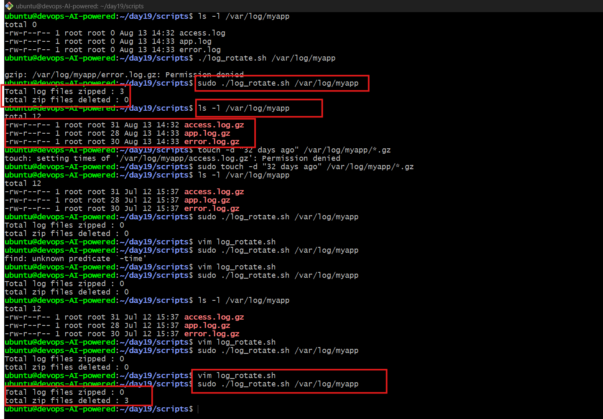
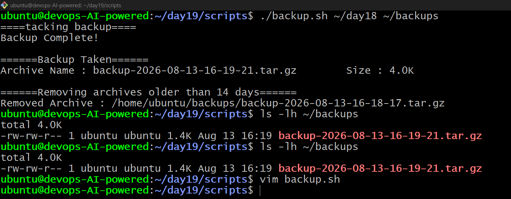
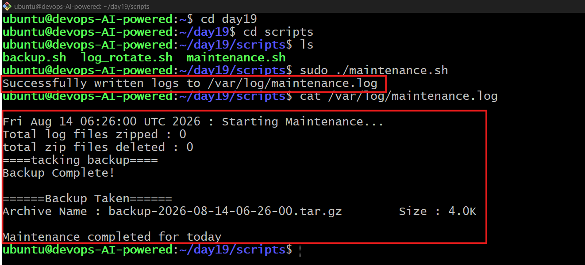
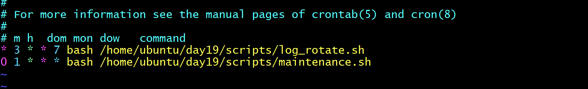

# Day 19 – Shell Scripting Project: Log Rotation, Backup & Crontab

## Overview

Day 19 focused on applying the Shell Scripting concepts from Days 16–18 to real-world server maintenance tasks.

### What I worked on

- Log rotation and compression
- Automated server backups
- Backup cleanup and retention
- Crontab scheduling
- Combining multiple scripts into a maintenance workflow
- Error handling, validation, timestamps, and command-line arguments

---

## Task 1 – Log Rotation

Created `log_rotate.sh` to automate log management.

### Features

- Accepts a log directory as an argument
- Validates that the directory exists
- Compresses `.log` files older than 7 days using `gzip`
- Deletes `.gz` files older than 30 days
- Reports the number of compressed and deleted files
- Exits with an error when the directory does not exist

### Script

`log_rotate.sh`

---

## screenshot
> 

## Task 2 – Server Backup

Created `backup.sh` for automated server backups.

### Features

- Accepts source and backup destination directories as arguments
- Creates a timestamped `.tar.gz` archive
- Verifies that the archive was created successfully
- Displays the archive name and size
- Removes backups older than 14 days
- Validates the source directory before starting

### Script

`backup.sh`

---
## screenshot

> 

## Task 3 – Crontab

Reviewed the existing cron jobs using:

```bash
crontab -l
```

### Cron Syntax

```text
* * * * * command
│ │ │ │ │
│ │ │ │ └── Day of week (0-7)
│ │ │ └──── Month (1-12)
│ │ └────── Day of month (1-31)
│ └──────── Hour (0-23)
└────────── Minute (0-59)
```

### Planned Cron Entries

> These entries were documented for learning and were not applied unless required.

#### Log rotation – Every day at 2 AM

```cron
0 2 * * * /path/to/log_rotate.sh /var/log/myapp
```

#### Server backup – Every Sunday at 3 AM

```cron
0 3 * * 0 /path/to/backup.sh /path/to/source /path/to/backups
```

#### Health check – Every 5 minutes

```cron
*/5 * * * * /path/to/health_check.sh
```

---

## Task 4 – Scheduled Maintenance

Created `maintenance.sh` to combine the maintenance workflow.

### Features

- Calls the log rotation function
- Calls the backup function
- Combines both maintenance operations
- Logs output to `/var/log/maintenance.log`
- Adds timestamps to maintenance logs
- Can be scheduled through cron

### Daily Maintenance Cron Entry

```cron
0 1 * * * /path/to/maintenance.sh
```

---
## Screenshot
> 

> 

## Key Learning

Day 19 helped me move from writing individual Bash commands and scripts to building a small automated server-maintenance workflow.

I practiced:

- Bash functions
- Arguments and variables
- Conditions and validation
- Exit codes
- File searching
- Compression
- Archiving
- Backup retention
- Cron scheduling
- Logging and automation


## Day 19 Completed 🚀

Another step toward building reliable and automated DevOps workflows with Linux and Shell Scripting.
