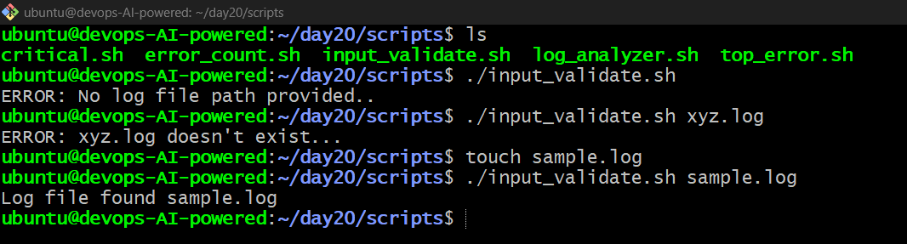
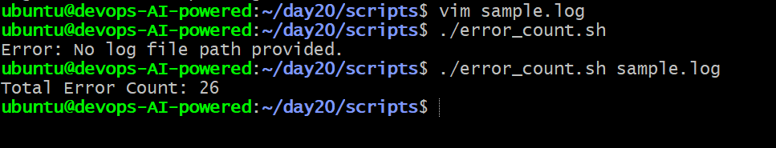
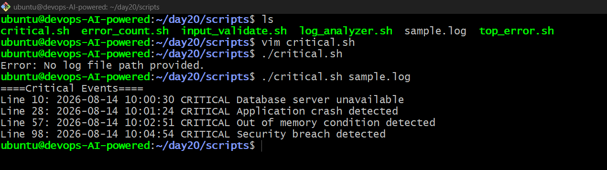
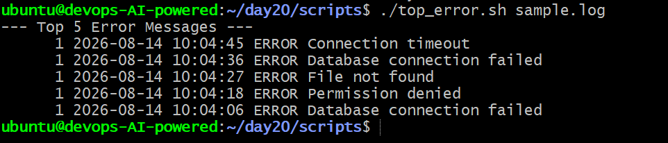
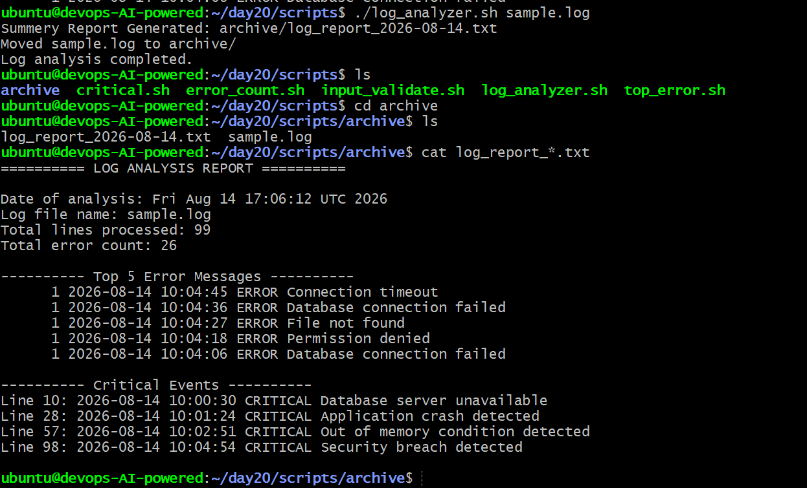

# Day 20 – Bash Scripting Challenge: Log Analyzer & Report Generator

This challenge focused on building a **Bash-based log analyzer** that validates a log file, detects errors and critical events, identifies common error messages, and generates a daily summary report.

## 🎯 Objectives

- Practice Bash command-line arguments and validation
- Analyze real-world log files
- Count `ERROR` and `Failed` events
- Extract `CRITICAL` events with line numbers
- Find the top 5 most common error messages
- Generate an automated summary report
- Archive processed logs

---

## Task 1 – Input & Validation

The script accepts a log file path as a command-line argument and validates:

- Whether a log file argument was provided
- Whether the specified file exists


### 📸 Screenshot

> 

---

## Task 2 – Error Count

The script searches the log file for lines containing:

- `ERROR`
- `Failed`

It calculates the total number of matching lines and displays the result.

Example:

```text
Total Error Count: 25
```

### 📸 Screenshot

> 

---

## Task 3 – Critical Events

The script searches for `CRITICAL` events and displays their line numbers along with the complete log entry.

Example:

```text
--- Critical Events ---
Line 10: CRITICAL Database server unavailable
Line 29: CRITICAL Application crash detected
Line 52: CRITICAL Out of memory condition detected
```

### 📸 Screenshot

> 

---

## Task 4 – Top 5 Error Messages

The script extracts `ERROR` entries and identifies the **5 most frequently occurring error messages**.

Example:

```text
--- Top 5 Error Messages ---
10 Database connection failed
8 Permission denied
6 File not found
5 Connection timeout
3 Disk I/O error
```

The results are sorted in descending order based on occurrence count.

### 📸 Screenshot

> 

---

## Task 5 – Summary Report

The script automatically generates a report using the current date:

```text
log_report_2026-08-14.txt
```

The report contains:

- Date of analysis
- Log file name
- Total lines processed
- Total error count
- Top 5 error messages
- Critical events with line numbers

Example:

```text
====================================
       DAILY LOG ANALYSIS REPORT
====================================

Date of Analysis: 2026-08-14
Log File: sample.log
Total Lines Processed: 100
Total Error Count: 25

--- Top 5 Error Messages ---
10 Database connection failed
8 Permission denied
6 File not found
5 Connection timeout
3 Disk I/O error

--- Critical Events ---
Line 10: CRITICAL Database server unavailable
Line 29: CRITICAL Application crash detected
Line 52: CRITICAL Out of memory condition detected

====================================
```

### 📸 Screenshot

> 

---

## Task 6 – Archive Processed Logs

As an optional improvement, the script can archive the processed log.

The script:

1. Creates an `archive/` directory if it doesn't exist
2. Moves the processed log file into the archive
3. Displays a confirmation message

Example:

```text
Log file archived successfully.
```

## 🧠 What I Learned

Through this challenge, I practiced:

- Bash command-line arguments
- Input and file validation
- `grep` pattern matching
- Counting and filtering log entries
- Extracting line numbers
- Using `sort`, `uniq`, and `head`
- Automating report generation
- Working with dates in Bash
- File and directory management
- Basic log-analysis automation

---

## 🚀 Final Outcome

By completing Day 20, I built a Bash-based **Log Analyzer and Report Generator** that can take a log file, analyze important events, generate useful statistics, create a daily report, and optionally archive the processed log.

This was a practical step toward automating common **Linux system administration and DevOps tasks**.

**Day 20 completed ✅**
