# Day 26 – GitHub CLI: Manage GitHub from Your Terminal

## 📌 Overview

Today I learned how to use **GitHub CLI (`gh`)** to manage GitHub repositories, issues, pull requests, workflows, and other GitHub features directly from the terminal.

---

# Task 1: Install and Authenticate

### 1. Install GitHub CLI

```bash
sudo apt update
```

Updates the Ubuntu package list before installing a new package.

```bash
sudo apt install gh -y
```

Installs the GitHub CLI (`gh`) on Ubuntu.

### 2. Authenticate with GitHub

```bash
gh auth login
```

Starts the GitHub CLI login process and connects the terminal with a GitHub account.

### 3. Check Authentication Status

```bash
gh auth status
```

Shows the currently authenticated GitHub account and authentication status.

### Authentication Methods Supported by `gh`

GitHub CLI supports browser-based login, Personal Access Tokens (PAT), and environment variables such as `GH_TOKEN` or `GITHUB_TOKEN`.

### 📸 Proof

> 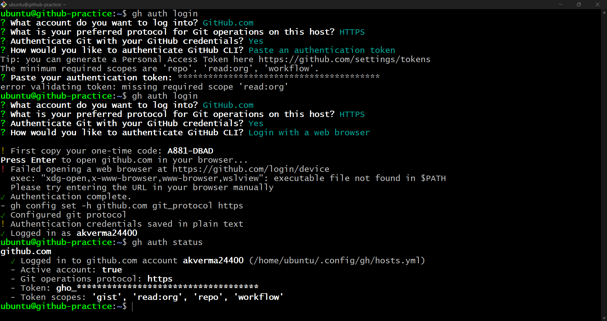

---

# Task 2: Working with Repositories

### 1. Create a Public Repository

```bash
gh repo create gh-cli-practice --public --add-readme
```

Creates a new public GitHub repository named `gh-cli-practice` with a README file.

### 📸 Proof

> 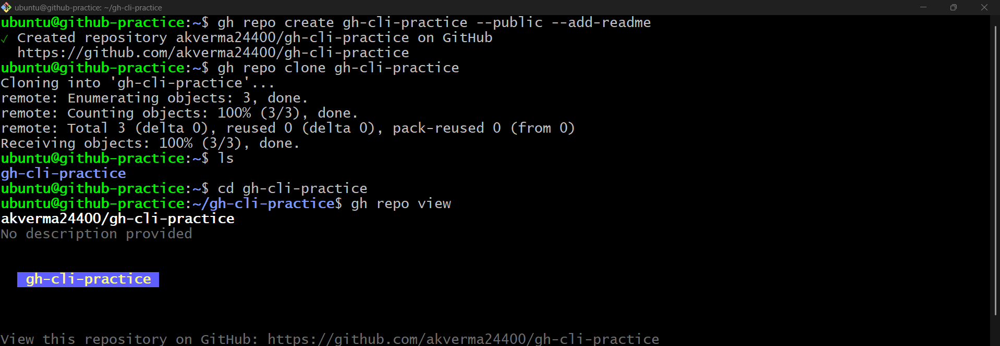

### 2. Clone a Repository

```bash
gh repo clone akverma24400/gh-cli-practice
```

Clones the GitHub repository to the local machine using GitHub CLI.

### 3. View Repository Details

```bash
gh repo view
```

Displays information about the current GitHub repository directly in the terminal.


### 4. List Repositories

```bash
gh repo list akverma24400
```

Lists repositories available under the specified GitHub account.

### 📸 Proof

> 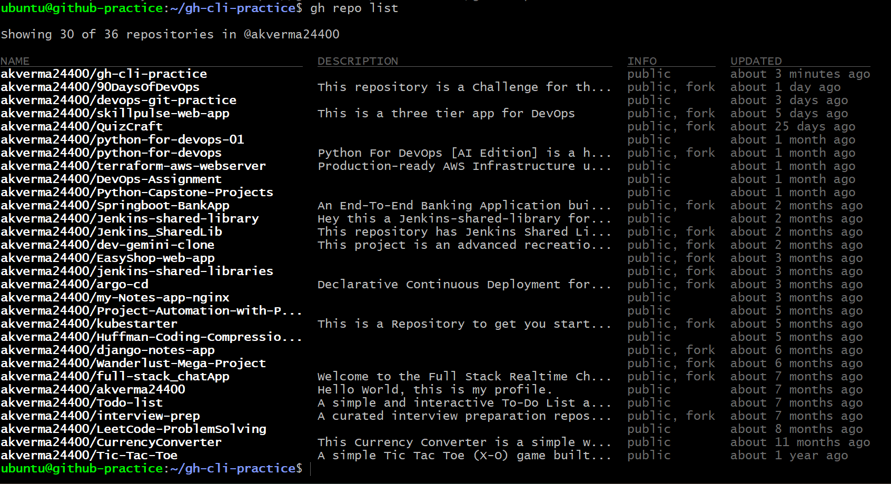

### 5. Open Repository in Browser

```bash
gh browse
```

Opens the current GitHub repository directly in the default web browser.

### 6. Delete Repository

```bash
gh repo delete akverma24400/gh-cli-practice
```

Deletes the specified GitHub repository after asking for confirmation.

### 📸 Proof

> 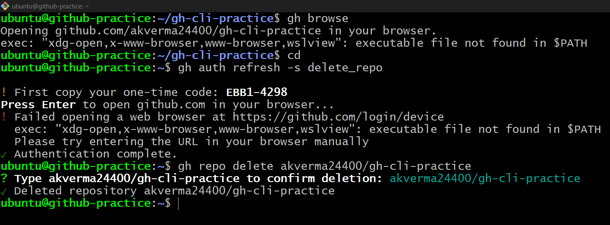

---

# Task 3: Issues

### 1. Create an Issue

```bash
gh issue create --title "Test issue" --body "Issue created using GitHub CLI" --label "bug"
```

Creates a new GitHub issue with a title, description, and label.

### 📸 Proof

> 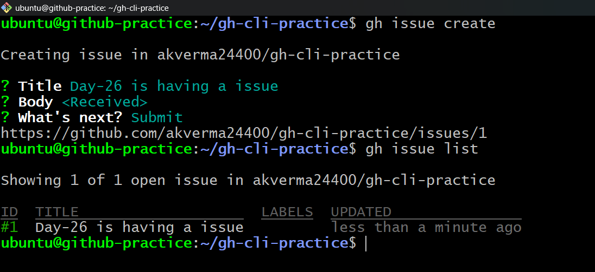

### 2. List Open Issues

```bash
gh issue list
```

Lists all currently open issues in the repository.

### 3. View a Specific Issue

```bash
gh issue view 1
```

Displays the complete details of issue number `1`.

### 4. Close an Issue

```bash
gh issue close 1
```

Closes issue number `1` directly from the terminal.

### 📸 Proof

> 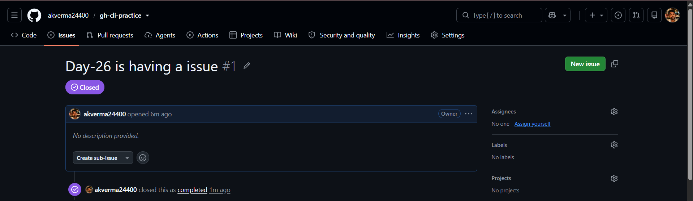

### How can `gh issue` be used in automation?

`gh issue` can be used in scripts to automatically create issues when builds fail, deployments fail, tests fail, or monitoring tools detect problems.

---

# Task 4: Pull Requests

### 1. Create a New Branch

```bash
git switch -c feature-1
```

Creates a new branch named `feature-1` and switches to it.

### 📸 Proof

> 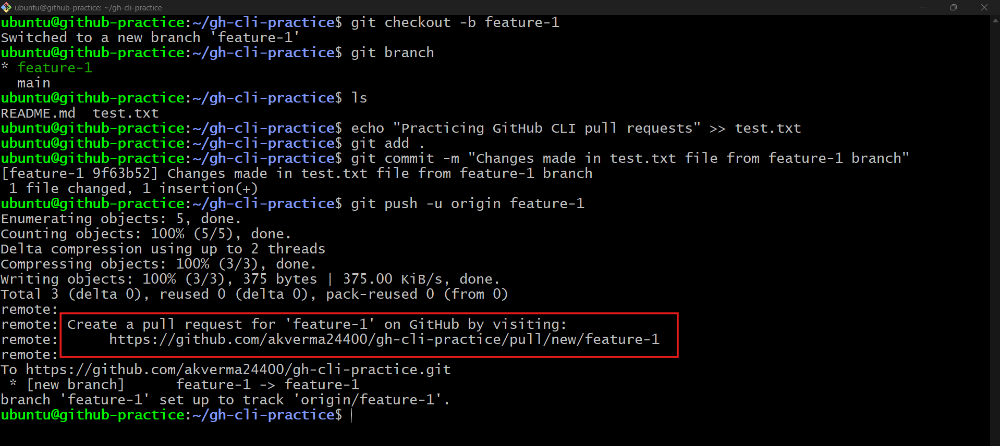

### 2. Make a Change

```bash
echo "GitHub CLI PR practice" >> practice.txt
```

Adds sample content to `practice.txt` for pull request practice.

### 3. Stage Changes

```bash
git add .
```

Adds all modified files to the Git staging area.

### 4. Commit Changes

```bash
git commit -m "Add Day 26 PR practice"
```

Creates a new Git commit containing the staged changes.

### 5. Push the Branch

```bash
git push -u origin feature-1
```

Pushes the `feature-1` branch to GitHub and sets its upstream branch.

### 6. Create a Pull Request

```bash
gh pr create --base main --head feature-1 --title "Add Day 26 GitHub CLI practice" --body "This PR was created entirely from the terminal using GitHub CLI."
```

Creates a pull request from `feature-1` into the `main` branch.

### 7. List Open Pull Requests

```bash
gh pr list
```

Lists all currently open pull requests in the repository.

### 📸 Proof

> 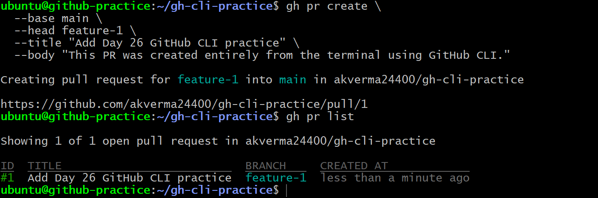

### 8. View Pull Request Details

```bash
gh pr view 1
```

Displays details of pull request number `1`, including its status and review information.

### 9. Check Pull Request Checks

```bash
gh pr checks 1
```

Shows CI/CD and status checks associated with pull request number `1`.

### 10. View Pull Request Changes

```bash
gh pr diff 1
```

Displays the code differences introduced by pull request number `1`.

### 📸 Proof

> 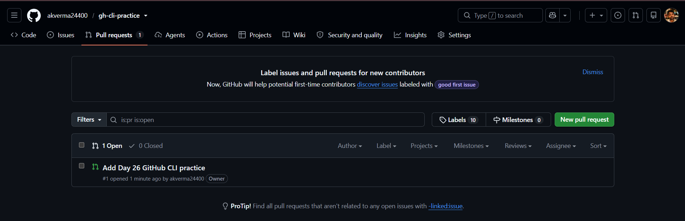

### 11. Merge Pull Request

```bash
gh pr merge 1 --merge
```

Merges pull request number `1` using the normal merge commit method.

### 📸 Proof

> 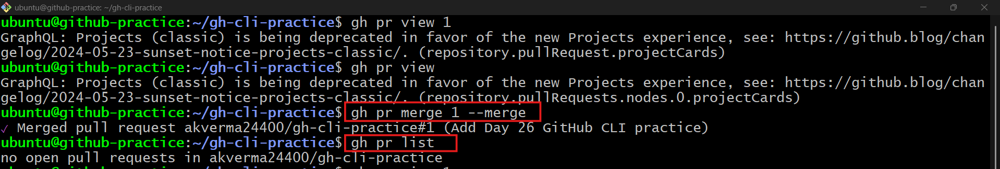

### Merge Methods Supported by `gh pr merge`

```bash
gh pr merge --merge
```

Creates a merge commit when merging the pull request.

```bash
gh pr merge --squash
```

Combines all pull request commits into a single commit before merging.

```bash
gh pr merge --rebase
```

Replays the pull request commits on top of the base branch before merging.

### Reviewing Someone Else's Pull Request

```bash
gh pr review <PR-number> --approve
```

Approves another contributor's pull request.

```bash
gh pr review <PR-number> --comment --body "Looks good."
```

Adds a review comment without approving or requesting changes.

```bash
gh pr review <PR-number> --request-changes --body "Please fix the issue."
```

Requests changes before the pull request can be merged.


# Task 5: GitHub Actions and Workflows

### 1. List Workflow Runs

```bash
gh run list
```

Lists recent GitHub Actions workflow runs for the current repository.

### 📸 Proof

> 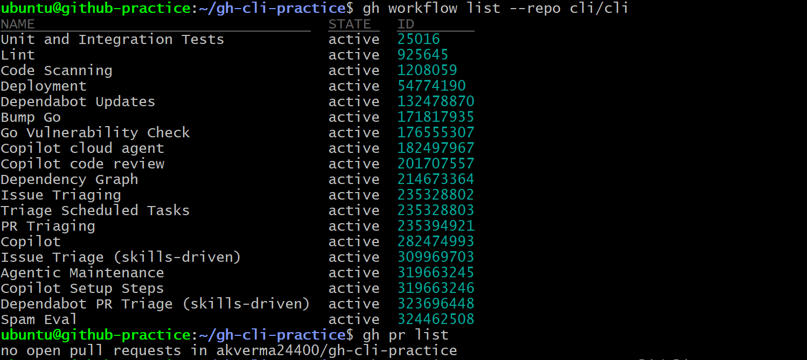

### 2. View a Specific Workflow Run

```bash
gh run view <run-id>
```

Shows detailed information about a particular GitHub Actions workflow run.

### 📸 Proof

> 

### 3. Watch a Workflow Run

```bash
gh run watch <run-id>
```

Continuously displays the live status of a running GitHub Actions workflow.

### 4. View Failed Logs

```bash
gh run view <run-id> --log-failed
```

Displays logs only from failed jobs or steps in the workflow run.

### 5. List Workflows

```bash
gh workflow list
```

Lists all GitHub Actions workflows configured in the repository.

### 6. View a Workflow

```bash
gh workflow view <workflow-name>
```

Displays information about a specific GitHub Actions workflow.

### How are `gh run` and `gh workflow` useful in CI/CD?

`gh run` and `gh workflow` can be used to monitor pipelines, inspect failures, rerun jobs, trigger workflows, and automate CI/CD operations from scripts or terminals.


---

# Task 6: Useful `gh` Tricks

### 1. GitHub API

```bash
gh api
```

Allows direct interaction with GitHub REST and GraphQL APIs from the terminal.

### 2. GitHub Gists

```bash
gh gist list
```

Lists GitHub Gists available for the authenticated account.

```bash
gh gist create <file>
```

Creates a new GitHub Gist from a local file.

### 3. GitHub Releases

```bash
gh release list
```

Lists releases available in the current GitHub repository.

```bash
gh release create <tag>
```

Creates a new GitHub release using the specified Git tag.

### 4. GitHub Aliases

```bash
gh alias list
```

Lists all custom GitHub CLI aliases.

```bash
gh alias set pv "pr view"
```

Creates a shortcut named `pv` for the `gh pr view` command.

### 5. Search GitHub Repositories

```bash
gh search repos "devops"
```

Searches GitHub repositories matching the keyword `devops`.


---

# 📚 Key Takeaways

- Learned how to manage GitHub directly from the terminal.
- Created, cloned, viewed, listed, and deleted repositories.
- Created and managed GitHub issues.
- Created, reviewed, checked, and merged pull requests.
- Explored GitHub Actions workflow commands.
- Learned useful commands such as `gh api`, `gh gist`, `gh release`, `gh alias`, and `gh search`.


## ✅ Day 26 Completed

GitHub CLI helps DevOps engineers manage GitHub resources faster and makes it easier to automate repository, issue, pull request, and CI/CD operations directly from the terminal.
