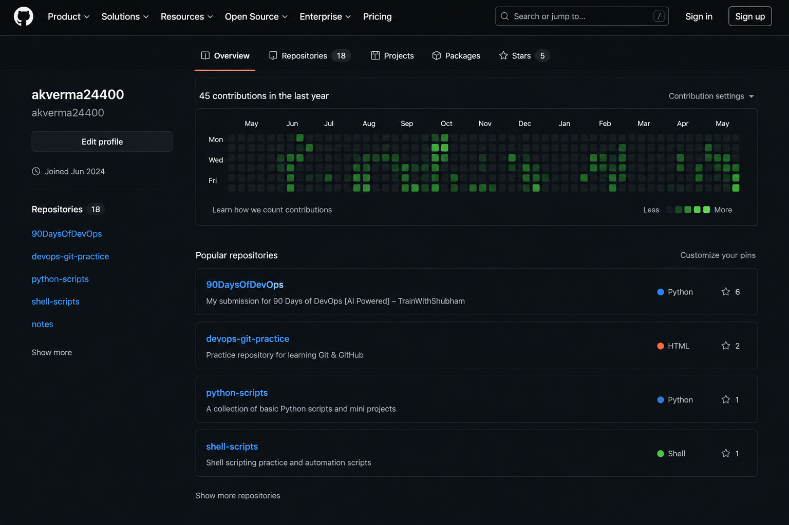

# Day 27 – GitHub Profile Makeover: Build Your Developer Identity

## 📌 Overview

Day 27 was focused on improving my **GitHub profile as a professional developer portfolio**.

The goal was to make my GitHub profile cleaner, easier to understand, and more useful for recruiters, hiring managers, and other developers.

Today I worked on:

- Auditing my existing GitHub profile
- Creating a professional GitHub profile README
- Organizing repositories
- Improving repository names, descriptions, and documentation
- Pinning my strongest projects
- Cleaning up unnecessary repositories
- Checking repositories for exposed secrets
- Comparing my profile before and after the makeover

---

## ✅ Task 1 – Audit My GitHub Profile

Before making changes, I reviewed my GitHub profile from the perspective of a recruiter or someone visiting it for the first time.

### Observations

- My profile picture was already suitable for a professional profile.
- My bio needed to clearly communicate that I am focused on **DevOps and Cloud Engineering**.
- Some repositories needed better descriptions and README files.
- My pinned repositories needed to represent my strongest DevOps and Cloud work.
- My profile needed a better structure so visitors could quickly understand my skills, projects, and learning journey.

### Improvements Planned

- Improve the profile bio.
- Create a professional profile README.
- Highlight DevOps and Cloud tools.
- Showcase important projects.
- Organize repositories properly.
- Add meaningful descriptions to repositories.
- Pin relevant DevOps projects.

---

## ✅ Task 2 – Create My GitHub Profile README

I created the special GitHub profile repository:

```text
akverma24400/akverma24400
```

The `README.md` inside this repository is displayed directly on my GitHub profile.

### Profile README Includes

- Professional introduction
- DevOps & Cloud Engineer headline
- Current learning journey
- DevOps and Cloud tools
- Featured projects
- 90 Days of DevOps progress
- GitHub statistics
- Contribution activity
- Contribution snake animation
- GitHub profile summary
- Contact information
- Career goal

### Main Technologies Highlighted

```text
AWS
Docker
Kubernetes
Terraform
Jenkins
GitHub Actions
ArgoCD
Helm
Prometheus
Grafana
Linux
Git
GitHub
Python
Bash
Go
Nginx
MySQL
MongoDB
Redis
```

### Profile Repository

```text
https://github.com/akverma24400/akverma24400
```

---

## ✅ Task 3 – Organize My Repositories

I reviewed my repositories and organized them so that each repository has a clear purpose.

### 1. 90 Days of DevOps

Repository used to document my daily DevOps learning and hands-on tasks.

```text
90DaysOfDevOps/
├── 2026/
│   ├── day-01/
│   ├── day-02/
│   ├── ...
│   └── day-27/
└── README.md
```

Repository:

```text
https://github.com/akverma24400/90DaysOfDevOps
```

### 2. Shell Scripts

A dedicated repository for shell scripting exercises and automation scripts.

Examples include:

- Basic shell scripts
- Loops and arguments
- Functions
- Disk and memory monitoring
- Log rotation
- Automated backups
- Log analyzer
- Shell scripting cheat sheet

Suggested structure:

```text
shell-scripts/
├── scripts/
│   ├── functions.sh
│   ├── disk_check.sh
│   ├── log_rotate.sh
│   ├── backup.sh
│   └── log_analyzer.sh
├── README.md
└── .gitignore
```

### 3. Python Scripts

A dedicated repository for Python automation and DevOps-related utilities.

```text
python-scripts/
├── scripts/
├── projects/
├── README.md
└── .gitignore
```

### 4. DevOps Notes

A repository for notes, cheat sheets, commands, and references.

```text
devops-notes/
├── Linux/
├── Git/
├── Shell-Scripting/
├── Python/
├── Kubernetes/
├── Terraform/
├── AWS/
├── git-commands.md
├── shell_scripting_cheatsheet.md
└── README.md
```

---

## ✅ Repository Standards Followed

For important repositories, I made sure to use:

- Clear repository names
- Hyphens instead of spaces
- One-line repository descriptions
- Proper `README.md` files
- Relevant `.gitignore`
- Organized folder structures
- Clear project documentation

Examples:

```text
shell-scripts
python-scripts
devops-notes
devops-git-practice
gh-cli-practice
```

---

## ✅ Task 4 – Pin My Best Repositories

I selected repositories that best represent my DevOps, Cloud, automation, and learning experience.

### Repositories to Highlight

1. **90DaysOfDevOps**
2. **skillpulse-web-app**
3. **Wanderlust-Mega-Project**
4. **EasyShop-web-app**
5. **terraform-aws-webserver**
6. **devops-git-practice**

These repositories demonstrate experience with:

```text
CI/CD
Docker
Kubernetes
AWS
Terraform
Jenkins
GitHub Actions
ArgoCD
Monitoring
Git
Linux
Automation
```

---

## ✅ Task 5 – GitHub Cleanup

I reviewed my GitHub repositories and cleaned up unnecessary content.

### Actions Taken

- Removed or archived unnecessary repositories.
- Improved unclear repository names.
- Added descriptions to important repositories.
- Improved README documentation.
- Checked repository organization.
- Reviewed repositories for accidentally committed sensitive files.

### Security Checks

I made sure that the following should never be pushed to public repositories:

```text
.env
*.pem
*.key
AWS access keys
API keys
Database passwords
GitHub tokens
Docker Hub passwords
Terraform secret variables
```

A typical `.gitignore` should contain:

```gitignore
.env
*.pem
*.key
terraform.tfstate
terraform.tfstate.*
.terraform/
node_modules/
venv/
__pycache__/
```

---

## ✅ Task 6 – Before & After

I compared my GitHub profile before and after the makeover.

### Before


> 


### After


> 

Recommended Day 27 structure:

```text
day-27/
├── images/
│   ├── github-profile-before.png
│   └── github-profile-after.png
├── README.md
└── day-27-notes.md
```

---

## 🚀 Three Major Improvements

### 1. Improved Personal Branding

I updated my profile so visitors can immediately understand that my main focus is:

```text
DevOps & Cloud Engineering
```

This makes my GitHub profile more relevant to the roles I am targeting.

### 2. Better Project Visibility

I organized and pinned important repositories so that my strongest DevOps projects are easier to discover.

### 3. Better Documentation

I improved repository descriptions, README files, folder structures, and project documentation.

Good documentation helps visitors understand:

- What the project does
- Which technologies were used
- How the project works
- What I learned
- How the project can be run

---

## 🧰 Tools & Skills Represented on My Profile

| Category | Tools |
|---|---|
| Cloud | AWS |
| Containers | Docker |
| Orchestration | Kubernetes, Helm |
| Infrastructure as Code | Terraform |
| CI/CD | Jenkins, GitHub Actions |
| GitOps | ArgoCD |
| Monitoring | Prometheus, Grafana |
| Version Control | Git, GitHub, GitHub CLI |
| Operating System | Linux |
| Scripting | Bash, Python |
| Web / Backend | Go, Node.js, Nginx |
| Databases | MySQL, MongoDB, Redis |

---

## 📚 What I Learned

This task helped me understand that GitHub is not only a place to store code.

A well-maintained GitHub profile can act as a **developer portfolio and technical resume**.

I learned the importance of:

- Personal branding
- Clean repository organization
- Strong project documentation
- Meaningful pinned repositories
- Security and secret management
- Making technical work easy to understand

---

## 🎯 Final Result

After completing Day 27, my GitHub profile is now more:

- Professional
- Organized
- Recruiter-friendly
- DevOps-focused
- Easy to navigate
- Project-oriented

My GitHub profile now gives visitors a clearer picture of my DevOps and Cloud learning journey, hands-on projects, and technical skills.

---

## 🔗 GitHub Profile

```text
https://github.com/akverma24400
```

---

## ✅ Day 27 Completed

**GitHub Profile Makeover — Completed ✅**

> A strong GitHub profile does not only show what you know — it shows what you build, how you learn, and how you document your work.
