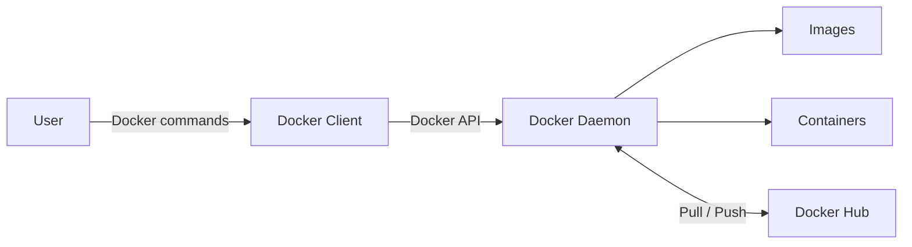

# Day 29 – Introduction to Docker

## Overview

On Day 29 of my **90 Days of DevOps** journey, I learned the fundamentals of Docker, understood how containers differ from virtual machines, installed Docker, and ran my first real containers.

## Learning Objectives

- Understand containers and why they are useful
- Compare containers with virtual machines
- Learn the main components of Docker architecture
- Install and verify Docker
- Run, inspect, stop, and remove containers
- Use container names, port mapping, logs, and `docker exec`

---

## Task 1: What Is Docker?

Docker is an open-source containerization platform used to package an application together with its code, runtime, libraries, and dependencies. This allows the application to run consistently across development, testing, and production environments.

### What Is a Container?

A container is a lightweight and isolated environment in which an application runs. Containers share the host operating system kernel but have their own processes, filesystem, network, and dependencies.

### Why Do We Need Containers?

- They solve the **“it works on my machine”** problem.
- They provide consistent application environments.
- They start faster and use fewer resources than virtual machines.
- They make applications easier to deploy, scale, and move.
- They isolate applications and their dependencies from one another.

### Containers vs Virtual Machines

| Feature | Containers | Virtual Machines |
|---|---|---|
| Virtualization | Operating-system level | Hardware level |
| Operating system | Share the host kernel | Each VM has a complete guest OS |
| Startup time | Usually seconds | Usually minutes |
| Resource usage | Lightweight | Resource-intensive |
| Image size | Usually MBs | Usually GBs |
| Portability | Highly portable | Less portable and larger |
| Isolation | Process-level isolation | Strong hardware-level isolation |

### Docker Architecture

Docker follows a client-server architecture:

- **Docker Client:** Accepts commands such as `docker run`, `docker pull`, and `docker ps`.
- **Docker Daemon (`dockerd`):** Runs in the background and manages images, containers, networks, and volumes.
- **Docker Image:** A read-only template containing the application and its dependencies.
- **Docker Container:** A running or stopped instance of an image.
- **Docker Registry:** Stores Docker images. Docker Hub is the default public registry.



### How `docker run` Works

When I run a command such as `docker run nginx`, the Docker client sends the request to the Docker daemon. The daemon checks whether the image is available locally. If it is missing, Docker pulls it from Docker Hub, creates a container from it, and starts the container.

---

## Task 2: Install Docker

I used an Ubuntu machine for this assignment.

### 1. Update the Package List

```bash
sudo apt update
```

### 2. Install Docker

```bash
sudo apt install -y docker.io
```

### 3. Start and Enable Docker

```bash
sudo systemctl enable --now docker
```

### 4. Allow the Current User to Run Docker

```bash
sudo usermod -aG docker "$USER"
newgrp docker
```

The `usermod` command adds the current user to the `docker` group. Logging out and signing in again also applies the new group membership.

### 5. Verify the Installation

```bash
docker --version
docker info
sudo systemctl status docker
```

### 6. Run the `hello-world` Container

```bash
docker run hello-world
```

### Observation

Docker searched for the `hello-world` image locally. Because it was not available, Docker downloaded it from Docker Hub, created a container, ran it, displayed the confirmation message, and then stopped the container.

### Screenshot


---

## Task 3: Run Real Containers

### 1. Run an Nginx Container

```bash
docker run -d --name day29-nginx -p 8080:80 nginx:alpine
```

Command explanation:

- `docker run` creates and starts a container.
- `-d` runs the container in detached mode.
- `--name day29-nginx` assigns a custom name.
- `-p 8080:80` maps host port `8080` to container port `80`.
- `nginx:alpine` is the image and tag used to create the container.

I accessed the Nginx welcome page at:

```text
http://<SERVER-PUBLIC-IP>:8080
```

If Docker is running locally, the page can be opened at `http://localhost:8080`.

> When using a cloud instance, inbound TCP port `8080` must be allowed only from an appropriate trusted source in the instance firewall or security group.

### Screenshot


### 2. Run Ubuntu in Interactive Mode

```bash
docker run -it --name day29-ubuntu ubuntu:latest bash
```

Inside the Ubuntu container, I explored the environment with:

```bash
cat /etc/os-release
pwd
ls -la
whoami
apt update
exit
```

The `-it` options attach an interactive terminal to the container. Running `exit` ends the shell and stops the container.

### Screenshot


### 3. List Running Containers

```bash
docker ps
```

This displays only containers that are currently running.

### 4. List All Containers

```bash
docker ps -a
```

This displays running, stopped, and exited containers.

### Screenshot


### 5. Stop and Remove Containers

```bash
docker stop day29-nginx
docker rm day29-nginx
docker rm day29-ubuntu
```

- `docker stop` gracefully stops a running container.
- `docker rm` removes a stopped container.

To stop and remove a running container in one command:

```bash
docker rm -f <container-name-or-id>
```

---

## Task 4: Explore Docker

### 1. Detached Mode

```bash
docker run -d nginx:alpine
```

Detached mode runs the container in the background and returns control of the terminal immediately. Without `-d`, the container output remains attached to the terminal.

### 2. Assign a Custom Container Name

```bash
docker run -d --name my-nginx nginx:alpine
```

A custom name makes the container easier to manage than using its generated ID or random name.

### 3. Map a Host Port

```bash
docker run -d --name nginx-demo -p 8080:80 nginx:alpine
```

Traffic received on host port `8080` is forwarded to Nginx on port `80` inside the container.

### 4. Check Container Logs

```bash
docker logs nginx-demo
docker logs -f nginx-demo
```

- `docker logs` displays the container logs.
- `docker logs -f` follows new log output in real time. Press `Ctrl+C` to stop following the logs without stopping the container.

### 5. Run a Command Inside a Running Container

```bash
docker exec -it nginx-demo /bin/sh
```

The Alpine-based Nginx image provides `/bin/sh` but normally does not include `/bin/bash`. Inside the container, I used:

```sh
hostname
ls -la /usr/share/nginx/html
cat /etc/os-release
exit
```

I also ran a single command without opening an interactive shell:

```bash
docker exec nginx-demo cat /etc/nginx/nginx.conf
```

### Screenshot


### Cleanup

```bash
docker stop nginx-demo my-nginx
docker rm nginx-demo my-nginx
```

---

## Commands Used

| Command | Purpose |
|---|---|
| `docker --version` | Displays the installed Docker version. |
| `docker info` | Displays detailed Docker engine information. |
| `docker run hello-world` | Tests Docker by running the hello-world image. |
| `docker pull <image>` | Downloads an image from a registry. |
| `docker images` | Lists images stored locally. |
| `docker run <image>` | Creates and starts a container from an image. |
| `docker run -it <image> bash` | Starts a container with an interactive Bash terminal. |
| `docker run -d <image>` | Starts a container in detached mode. |
| `docker run --name <name> <image>` | Creates a container with a custom name. |
| `docker run -p <host-port>:<container-port> <image>` | Publishes a container port on the host. |
| `docker ps` | Lists running containers. |
| `docker ps -a` | Lists all containers. |
| `docker logs <container>` | Displays a container's logs. |
| `docker logs -f <container>` | Follows a container's logs in real time. |
| `docker exec -it <container> /bin/sh` | Opens an interactive shell in a running container. |
| `docker stop <container>` | Stops a running container. |
| `docker start <container>` | Starts a stopped container. |
| `docker rm <container>` | Removes a stopped container. |
| `docker rm -f <container>` | Force-removes a running container. |

---

## Key Takeaways

- A Docker image is a reusable template, while a container is an instance of that image.
- Containers share the host kernel, which makes them lighter and faster than virtual machines.
- The Docker client sends requests to the Docker daemon.
- Docker Hub stores and distributes container images.
- Port mapping makes a containerized service accessible from the host.
- Detached containers run in the background and can be inspected using logs and `docker exec`.
- Containers are disposable, so important persistent data should later be stored using Docker volumes or external services.

## Conclusion

Day 29 gave me a solid introduction to Docker. I successfully installed Docker, ran the `hello-world`, Nginx, and Ubuntu containers, and practiced the basic container lifecycle. I also learned how Docker uses images, containers, the daemon, the client, and registries to provide a consistent and portable application environment.

---
