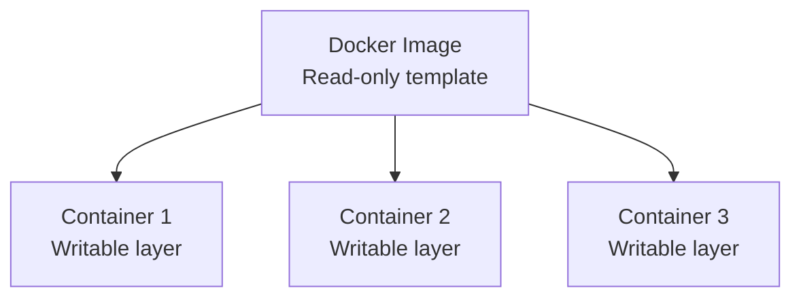
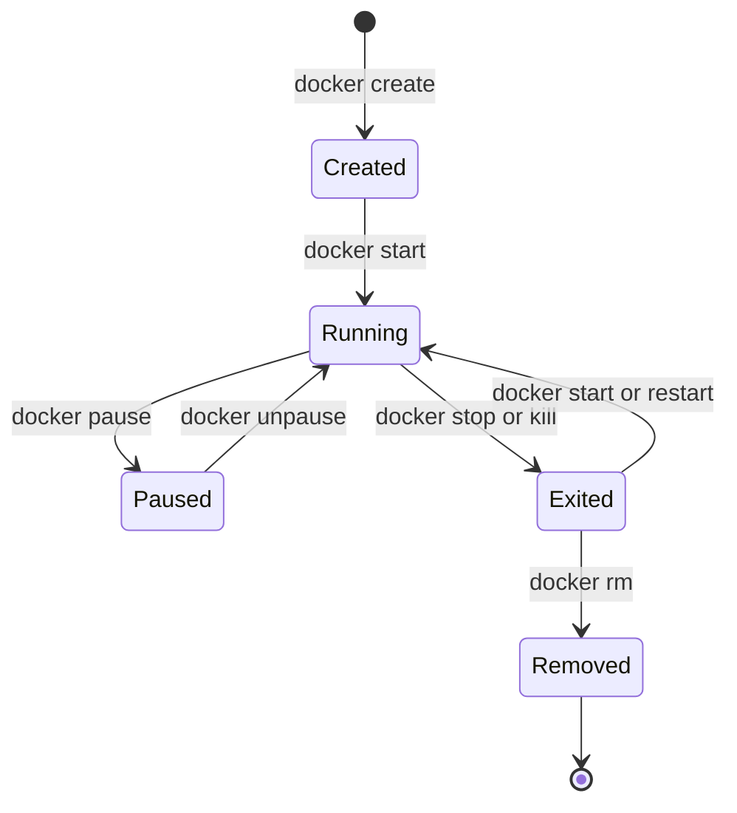

# Day 30 – Docker Images & Container Lifecycle

## Overview

On Day 30 of my **90 Days of DevOps** journey, I explored Docker images, image layers, caching, and the complete container lifecycle. I also practiced inspecting images and containers, viewing logs, executing commands inside a running container, and safely cleaning unused Docker resources.

## Learning Objectives

- Understand the relationship between Docker images and containers
- Pull, list, inspect, and remove Docker images
- Learn how image layers and Docker caching work
- Practice the complete container lifecycle
- Work with logs and running containers
- Inspect container networking, port mappings, and mounts
- Clean unused containers and images safely

---

## Images and Containers

A **Docker image** is a read-only template that contains an application, its runtime, libraries, configuration, and other required files. A **container** is a runnable instance of an image.

Multiple containers can be created from the same image. Each container receives its own writable layer, while the underlying read-only image layers can be shared.



---

## Task 1: Docker Images

### 1. Pull Images from Docker Hub

```bash
docker pull nginx:latest
docker pull ubuntu:latest
docker pull alpine:latest
```

The `docker pull` command downloads an image and its layers from a container registry. Docker Hub is used by default when no other registry is specified.

### 2. List Local Images

```bash
docker images
```

The output includes the repository, tag, image ID, creation time, and local size of each image.

```bash
docker image ls
```

`docker image ls` is the newer command form and produces the same basic result as `docker images`.

### My Observation

| Image | Purpose | Size Observation |
|---|---|---|
| `nginx:latest` | Nginx web server and its required runtime files | Larger than Alpine because it includes Nginx and supporting packages |
| `ubuntu:latest` | General-purpose Ubuntu base image | Much larger than Alpine |
| `alpine:latest` | Minimal Linux base image | The smallest of the three images |

The exact sizes may vary by image version and CPU architecture, so I recorded the values shown by `docker images` in my screenshot.

### Screenshot


### 3. Ubuntu vs Alpine

Ubuntu is larger because it provides a broader user-space environment, the `apt` package manager, GNU libraries, and more standard utilities. Alpine is designed to be minimal and mainly uses BusyBox utilities, the `apk` package manager, and the musl C library.

| Feature | Ubuntu | Alpine |
|---|---|---|
| Main goal | General-purpose Linux environment | Minimal container-focused environment |
| Package manager | `apt` | `apk` |
| C library | glibc | musl libc |
| Utilities | Broader set of tools | Minimal BusyBox-based tools |
| Image size | Larger | Much smaller |
| Compatibility | Broad software compatibility | Some applications may need extra work |
| Debugging | Easier because more tools are available | May require installing debugging tools |

Alpine can reduce download time and storage use, but the smallest image is not automatically the best choice. Application compatibility, security updates, and debugging requirements must also be considered.

### 4. Inspect an Image

```bash
docker image inspect nginx:latest
```

The inspection output is JSON and includes information such as:

- Image ID and repository tags
- Creation time
- CPU architecture and operating system
- Environment variables
- Entrypoint and default command
- Exposed ports
- Filesystem layer identifiers
- Image configuration and metadata

I also used formatted inspection commands to display specific values:

```bash
docker image inspect --format '{{.Os}}/{{.Architecture}}' nginx:latest
docker image inspect --format '{{json .Config.ExposedPorts}}' nginx:latest
docker image inspect --format '{{json .RootFS.Layers}}' nginx:latest
```

### Screenshot


### 5. Remove an Image

```bash
docker image rm alpine:latest
```

Docker removes the image only when it is not being used by a container. If a stopped container still references the image, that container should be removed first.

```bash
docker image ls
```

I listed the images again to confirm that the image had been removed.

---

## Task 2: Image Layers

### View Nginx Image History

```bash
docker image history nginx:latest
```

For a complete command display without truncation:

```bash
docker image history --no-trunc nginx:latest
```

### What Are Image Layers?

A Docker image is built from a collection of read-only filesystem layers. During an image build, instructions that add or modify filesystem content can create new layers. Docker stores these layers using content-based identifiers.

Examples of instructions that commonly add filesystem content include:

- Installing packages
- Copying application files
- Creating or modifying files

Instructions such as `CMD`, `ENTRYPOINT`, `ENV`, `EXPOSE`, and `LABEL` mainly change image metadata. These history entries often show a size of `0B` because they do not add files to the image filesystem.

### Why Docker Uses Layers

- **Caching:** Unchanged layers can be reused during later builds.
- **Faster builds:** Docker rebuilds only the changed layer and the layers after it.
- **Efficient downloads:** Existing layers do not need to be downloaded again.
- **Shared storage:** Images and containers can reuse identical layers.
- **Distribution:** Registries transfer images as individual layers.

### Layer Caching Example

If an early Dockerfile instruction changes, Docker normally rebuilds that layer and all later layers. For this reason, frequently changing instructions are usually placed later in a Dockerfile, while stable dependency-installation steps are placed earlier when practical.

### Screenshot


---

## Task 3: Container Lifecycle

I practiced the complete lifecycle using an Nginx container named `lifecycle-demo`.



### 1. Create a Container Without Starting It

```bash
docker create --name lifecycle-demo -p 8080:80 nginx:latest
docker ps -a
```

**Observed state:** `Created`

`docker create` prepares the container filesystem, metadata, and configuration but does not start its main process.

### 2. Start the Container

```bash
docker start lifecycle-demo
docker ps -a
```

**Observed state:** `Up` or `Running`

### 3. Pause the Container

```bash
docker pause lifecycle-demo
docker ps -a
```

**Observed state:** `Up (Paused)`

Pausing suspends the processes inside the container without stopping or removing them.

### 4. Unpause the Container

```bash
docker unpause lifecycle-demo
docker ps -a
```

**Observed state:** `Up` or `Running`

### 5. Stop the Container

```bash
docker stop lifecycle-demo
docker ps -a
```

**Observed state:** `Exited`

Docker first sends a graceful termination signal to the container's main process. If the process does not exit within the allowed timeout, Docker forcefully terminates it.

### 6. Restart the Container

```bash
docker restart lifecycle-demo
docker ps -a
```

**Observed state:** `Up` or `Running`

`docker restart` stops and then starts the same container while preserving its configuration.

### 7. Kill the Container

```bash
docker kill lifecycle-demo
docker ps -a
```

**Observed state:** `Exited`

`docker kill` immediately terminates the container's main process. I would normally prefer `docker stop` for a graceful shutdown and use `docker kill` only when necessary.

### 8. Remove the Container

```bash
docker rm lifecycle-demo
docker ps -a
```

After removal, the container no longer appears in `docker ps -a`.

### Lifecycle Observation Table

| Action | Command | Container State |
|---|---|---|
| Create | `docker create` | Created |
| Start | `docker start` | Running |
| Pause | `docker pause` | Paused |
| Unpause | `docker unpause` | Running |
| Stop | `docker stop` | Exited |
| Restart | `docker restart` | Running |
| Kill | `docker kill` | Exited |
| Remove | `docker rm` | Removed |

### Screenshot


---

## Task 4: Working with Running Containers

### 1. Run Nginx in Detached Mode

```bash
docker run -d --name day30-nginx -p 8080:80 nginx:alpine
docker ps
```

I generated an HTTP request so the container would produce an access log:

```bash
curl http://localhost:8080
```

### 2. View Container Logs

```bash
docker logs day30-nginx
```

This displayed the standard output and standard error produced by the Nginx container.

### 3. Follow Real-Time Logs

```bash
docker logs -f day30-nginx
```

The `-f` option follows new log entries in real time. I pressed `Ctrl+C` to stop following the logs without stopping the container.

### 4. Open a Shell Inside the Container

```bash
docker exec -it day30-nginx /bin/sh
```

The Alpine-based Nginx image provides `/bin/sh` and normally does not include `/bin/bash`.

Inside the container, I explored the filesystem using:

```sh
pwd
hostname
ls -la /
ls -la /etc/nginx
ls -la /usr/share/nginx/html
cat /etc/os-release
exit
```

### 5. Run a Single Command Without Entering the Container

```bash
docker exec day30-nginx nginx -v
docker exec day30-nginx cat /etc/os-release
```

`docker exec` runs a new command inside an already running container. It does not create a new container.

### Screenshot


### 6. Inspect the Container

```bash
docker inspect day30-nginx
```

The JSON output includes the container configuration, state, networking, port bindings, mounts, environment variables, and other metadata.

#### Find the Container IP Address

```bash
docker inspect --format '{{range .NetworkSettings.Networks}}{{.IPAddress}}{{end}}' day30-nginx
```

This IP address belongs to the container's Docker network. External clients normally access the service through the host's published port instead of using this internal address directly.

#### Find Port Mappings

```bash
docker port day30-nginx
docker inspect --format '{{json .NetworkSettings.Ports}}' day30-nginx
```

The mapping shows that host port `8080` forwards traffic to container port `80`.

#### Find Mounts

```bash
docker inspect --format '{{json .Mounts}}' day30-nginx
```

Because I did not attach a bind mount or volume when creating this container, the mounts list may be empty.

### Screenshot


---

## Task 5: Cleanup

### 1. Stop All Running Containers

```bash
docker ps -q | xargs -r docker stop
```

- `docker ps -q` prints only the IDs of running containers.
- `xargs -r` runs `docker stop` only when at least one container ID exists.

### 2. Remove All Stopped Containers

```bash
docker container prune
```

Docker displays the resources that will be affected and asks for confirmation before removing all stopped containers.

### 3. Remove Unused Images

To remove dangling image layers:

```bash
docker image prune
```

To remove all images that are not referenced by a container:

```bash
docker image prune -a
```

The `-a` option has a wider effect, so I reviewed the images before confirming the cleanup.

### 4. Check Docker Disk Usage

```bash
docker system df
docker system df -v
```

- `docker system df` displays summarized disk usage for images, containers, local volumes, and build cache.
- `docker system df -v` displays a more detailed breakdown.

### Verification

```bash
docker ps -a
docker image ls
docker system df
```

### Screenshot


---

## Commands Used

| Command | Purpose |
|---|---|
| `docker pull <image>` | Downloads an image from a registry. |
| `docker images` | Lists images stored locally. |
| `docker image ls` | Lists locally available Docker images. |
| `docker image inspect <image>` | Displays detailed JSON metadata for an image. |
| `docker image history <image>` | Displays the instructions and layers that form an image. |
| `docker image rm <image>` | Removes an image that is no longer in use. |
| `docker create <image>` | Creates a container without starting it. |
| `docker start <container>` | Starts a created or stopped container. |
| `docker pause <container>` | Suspends the processes inside a running container. |
| `docker unpause <container>` | Resumes the processes inside a paused container. |
| `docker stop <container>` | Gracefully stops a running container. |
| `docker restart <container>` | Stops and starts a container. |
| `docker kill <container>` | Immediately terminates a running container. |
| `docker rm <container>` | Removes a stopped container. |
| `docker ps` | Lists running containers. |
| `docker ps -a` | Lists containers in all states. |
| `docker logs <container>` | Displays logs produced by a container. |
| `docker logs -f <container>` | Follows new log entries in real time. |
| `docker exec -it <container> /bin/sh` | Opens an interactive shell in a running container. |
| `docker exec <container> <command>` | Runs one command inside a running container. |
| `docker inspect <container>` | Displays detailed container information as JSON. |
| `docker port <container>` | Displays a container's published port mappings. |
| `docker container prune` | Removes all stopped containers after confirmation. |
| `docker image prune` | Removes dangling images after confirmation. |
| `docker image prune -a` | Removes all images not referenced by a container after confirmation. |
| `docker system df` | Displays Docker disk usage. |

---

## Key Takeaways

- An image is a read-only template, while a container is a running or stopped instance of that image.
- Containers add a writable layer on top of shared read-only image layers.
- Docker layers improve build caching, downloads, and disk efficiency.
- Metadata-only image history entries often show `0B` because they do not add filesystem content.
- A container can move through created, running, paused, and exited states before being removed.
- `docker stop` attempts a graceful shutdown, while `docker kill` terminates the process immediately.
- `docker inspect` provides detailed information about images and containers.
- Docker cleanup commands should be reviewed carefully because unused resources may still be valuable for future work.

## Conclusion

Day 30 helped me understand how Docker images are constructed and how containers move through their lifecycle. I practiced managing images, examining image layers, controlling container states, inspecting running containers, and safely cleaning Docker resources. These concepts are essential for building and operating containerized applications efficiently.

---