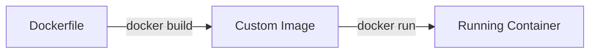
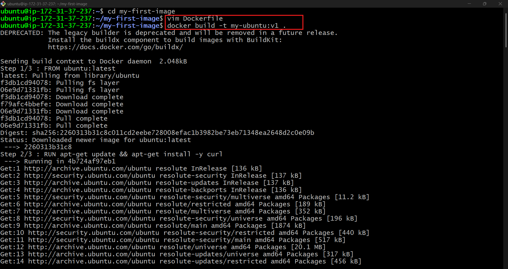
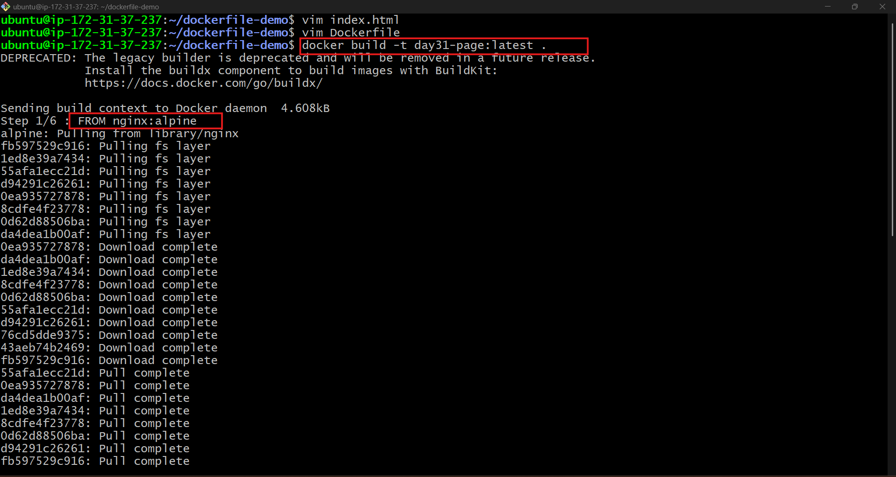
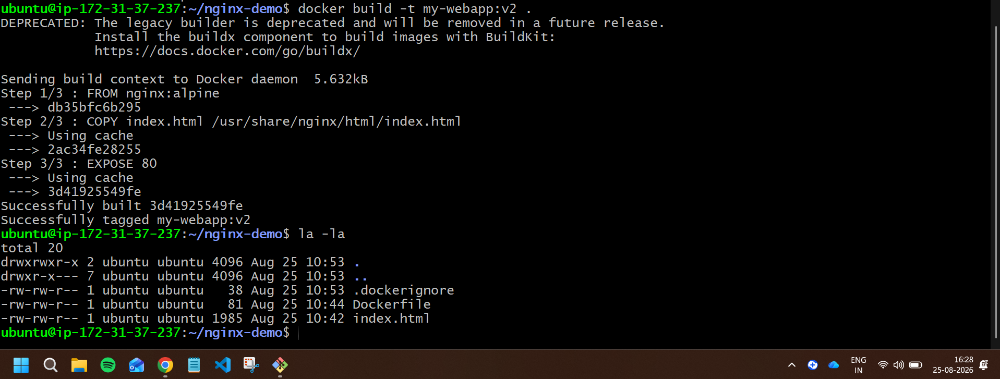
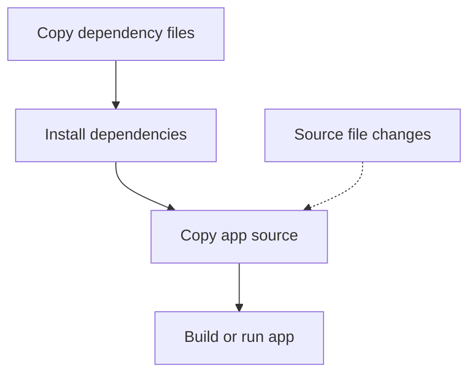

# Day 31 – Dockerfile: Build Your Own Images

## Overview

On Day 31 of my **90 Days of DevOps** journey, I learned how to write Dockerfiles and build custom Docker images. I practiced common Dockerfile instructions, understood the difference between `CMD` and `ENTRYPOINT`, containerized a static website with Nginx, used `.dockerignore`, and explored Docker build caching.

## Learning Objectives

- Create custom Docker images using Dockerfiles
- Understand the purpose of common Dockerfile instructions
- Build and run images with tags
- Compare `CMD` and `ENTRYPOINT`
- Containerize a static HTML website with Nginx
- Exclude unnecessary files using `.dockerignore`
- Optimize build speed using Docker layer caching

---

## What Is a Dockerfile?

A Dockerfile is a text file containing instructions that Docker uses to build an image. Each instruction helps define the image's base operating system, installed packages, application files, configuration, and default startup command.



---

## Task 1: My First Dockerfile

### Project Structure

```text
my-first-image/
└── Dockerfile
```

### Dockerfile

Create a folder and enter it:

```bash
mkdir my-first-image
cd my-first-image
```

Create a file named `Dockerfile` with the following content:

```dockerfile
FROM ubuntu:24.04

RUN apt-get update \
    && DEBIAN_FRONTEND=noninteractive apt-get install -y --no-install-recommends curl \
    && rm -rf /var/lib/apt/lists/*

CMD ["echo", "Hello from my custom image!"]
```

### Explanation

| Instruction | Purpose |
|---|---|
| `FROM ubuntu:24.04` | Uses Ubuntu 24.04 as the base image. |
| `RUN ...` | Installs `curl` while the image is being built. |
| `rm -rf /var/lib/apt/lists/*` | Removes APT package-list cache to keep the image smaller. |
| `CMD [...]` | Defines the default command that runs when a container starts. |

### Build the Image

```bash
docker build -t my-ubuntu:v1 .
```

- `-t my-ubuntu:v1` assigns the image repository name `my-ubuntu` and tag `v1`.
- `.` tells Docker to use the current directory as the build context.

### Run the Image

```bash
docker run --rm my-ubuntu:v1
```

### Verification

Expected output:

```text
Hello from my custom image!
```

I also verified that `curl` was installed:

```bash
docker run --rm my-ubuntu:v1 curl --version
```

> The command supplied after the image name replaces the Dockerfile `CMD` for that one container run.

### Screenshot

> 

---

## Task 2: Dockerfile Instructions

### Project Structure

```text
dockerfile-instructions/
├── Dockerfile
└── index.html
```

### `index.html`

```html
<!DOCTYPE html>
<html lang="en">
  <head>
    <meta charset="UTF-8" />
    <meta name="viewport" content="width=device-width, initial-scale=1.0" />
    <title>Dockerfile Instructions</title>
  </head>
  <body>
    <h1>Dockerfile Instructions Demo</h1>
    <p>This page is served from my custom Docker image.</p>
  </body>
</html>
```

### Dockerfile

```dockerfile
FROM nginx:alpine

WORKDIR /usr/share/nginx/html

RUN rm -f index.html

COPY index.html ./

EXPOSE 80

CMD ["nginx", "-g", "daemon off;"]
```

### Explanation of Each Instruction

| Instruction | Purpose |
|---|---|
| `FROM nginx:alpine` | Starts from the lightweight Alpine-based Nginx image. |
| `WORKDIR /usr/share/nginx/html` | Sets the working directory used by following instructions. |
| `RUN rm -f index.html` | Deletes the default Nginx page during image build. |
| `COPY index.html ./` | Copies the local HTML file into Nginx's web root. |
| `EXPOSE 80` | Documents that the application listens on port 80. It does not publish the port by itself. |
| `CMD [...]` | Starts Nginx in the foreground so the container remains running. |

### Build and Run

```bash
docker build -t dockerfile-instructions:v1 .
docker run -d --name instructions-demo -p 8081:80 dockerfile-instructions:v1
```

Open the website locally at:

```text
http://localhost:8081
```

For a cloud server, use:

```text
http://<SERVER-PUBLIC-IP>:8081
```

> Ensure host port `8081` is allowed only from an appropriate trusted source in the server firewall or cloud security group.

### Screenshot

> 

---

## Task 3: `CMD` vs `ENTRYPOINT`

### 1. `CMD` Demo

### Dockerfile

```dockerfile
FROM alpine:3.22

CMD ["echo", "hello"]
```

Build the image:

```bash
docker build -t cmd-demo:v1 .
```

Run it without a custom command:

```bash
docker run --rm cmd-demo:v1
```

Output:

```text
hello
```

Run it with a custom command:

```bash
docker run --rm cmd-demo:v1 echo "custom command"
```

Output:

```text
custom command
```

### Observation

Arguments written after the image name replace the Dockerfile `CMD`. Therefore, `CMD` is best used for a default command or default arguments that a user may want to override.

### 2. `ENTRYPOINT` Demo

### Dockerfile

```dockerfile
FROM alpine:3.22

ENTRYPOINT ["echo"]
```

Build the image:

```bash
docker build -t entrypoint-demo:v1 .
```

Run it with an additional argument:

```bash
docker run --rm entrypoint-demo:v1 hello
```

Output:

```text
hello
```

Run it with more arguments:

```bash
docker run --rm entrypoint-demo:v1 Docker makes deployment easier
```

Output:

```text
Docker makes deployment easier
```

### Observation

Arguments written after the image name are appended to the `ENTRYPOINT` command. In this example, Docker runs `echo` followed by the supplied words.

To override an entrypoint deliberately:

```bash
docker run --rm --entrypoint /bin/sh entrypoint-demo:v1
```

### When to Use `CMD` vs `ENTRYPOINT`

| Feature | `CMD` | `ENTRYPOINT` |
|---|---|---|
| Main purpose | Provide a default command or default arguments | Define the fixed executable for the container |
| Custom command after image name | Replaces the `CMD` | Becomes arguments for the entrypoint |
| Common use case | A default development or runtime command | A purpose-built image that should always run one tool or application |
| Override method | Supply a command after the image name | Use `--entrypoint` when an override is required |

Example: a general-purpose Ubuntu image often uses `CMD` because users may want different commands. A dedicated CLI image may use `ENTRYPOINT` so that every `docker run` executes that CLI tool.

---

## Task 4: Build a Simple Web App Image

### Build and Run

```bash
docker build -t my-website:v1 .
docker run -d --name my-website-container -p 8080:80 my-website:v1
```

Access the website at:

```text
http://localhost:8080
```

Or, on an EC2/cloud server:

```text
http://<SERVER-PUBLIC-IP>:8080
```

### Verify the Container

```bash
docker ps
docker logs my-website-container
curl http://localhost:8080
```

### Screenshot

> 

---

## Task 5: `.dockerignore`

### Why Use `.dockerignore`?

The `.dockerignore` file tells Docker which files and directories must be excluded from the build context. This makes builds faster, prevents unnecessary files from entering the image, and reduces the chance of accidentally copying sensitive files.

### `.dockerignore` File

Create `.dockerignore` in the project root:

```dockerignore
node_modules
.git
*.md
.env
```

### Verification Demo

For a clear test, use a small project with this Dockerfile:

```dockerfile
FROM alpine:3.22

WORKDIR /app

COPY . .

CMD ["find", "/app", "-maxdepth", "2", "-type", "f"]
```

Build and inspect the copied files:

```bash
docker build --no-cache -t ignore-demo:v1 .
docker run --rm ignore-demo:v1
```

The output should include allowed project files but should not include files matching `.env`, `*.md`, `.git`, or `node_modules`.

> A `.dockerignore` reduces accidental exposure, but sensitive values should not be baked into image layers. Use runtime environment variables, Docker secrets, or a dedicated secret manager for real credentials.


---

## Task 6: Build Optimization and Layer Caching

### Docker Build Cache

Docker builds images in layers. If an instruction and all of its input files are unchanged, Docker can reuse the cached layer instead of running that instruction again.

To view detailed build output:

```bash
docker build --progress=plain -t cache-demo:v1 .
```

Build the image once, change only one line in a late layer such as `index.html`, and build it again:

```bash
docker build --progress=plain -t cache-demo:v2 .
```

The earlier unchanged layers should display `CACHED` in the build output.

### Less Efficient Dockerfile Order

```dockerfile
FROM node:22-alpine

WORKDIR /app

COPY . .
RUN npm ci

CMD ["npm", "start"]
```

If any application source file changes, `COPY . .` changes. Docker must then rebuild the later `RUN npm ci` layer even when dependencies did not change.

### Optimized Dockerfile Order

```dockerfile
FROM node:22-alpine

WORKDIR /app

COPY package.json package-lock.json ./
RUN npm ci

COPY . .

CMD ["npm", "start"]
```

With this order, Docker can reuse the `npm ci` layer whenever `package.json` and `package-lock.json` stay unchanged. Editing only application source code rebuilds the final `COPY . .` layer instead of reinstalling all dependencies.



### Why Layer Order Matters

- Docker cache is evaluated from top to bottom.
- When one layer changes, Docker rebuilds that layer and the layers after it.
- Stable steps should be placed earlier in the Dockerfile.
- Frequently changing source files should be copied later.
- Efficient layer order speeds up local development and CI/CD builds.

---

## Commands Used

| Command | Purpose |
|---|---|
| `docker build -t <image>:<tag> .` | Builds an image from the Dockerfile in the current directory. |
| `docker run --rm <image>` | Runs a container and automatically removes it after it exits. |
| `docker run -d --name <name> -p <host>:<container> <image>` | Runs a named container in the background with port mapping. |
| `docker images` | Lists local Docker images. |
| `docker ps` | Lists running containers. |
| `docker logs <container>` | Displays logs from a container. |
| `docker exec <container> <command>` | Runs a command inside a running container. |
| `docker build --no-cache ...` | Builds an image without reusing cached layers. |
| `docker build --progress=plain ...` | Shows detailed Docker build output, including cached layers. |
| `docker run --entrypoint <command> <image>` | Overrides an image's configured entrypoint. |

---

## Key Takeaways

- A Dockerfile is the blueprint used to create a repeatable Docker image.
- `FROM` selects a base image, while `RUN` performs build-time actions.
- `COPY` adds files from the build context to the image.
- `WORKDIR` sets the working directory for following instructions and runtime commands.
- `EXPOSE` documents a listening port but does not publish it; `docker run -p` publishes a port.
- `CMD` provides a default command that can be replaced at runtime.
- `ENTRYPOINT` defines the main executable and receives runtime arguments.
- `.dockerignore` keeps unneeded and sensitive files out of the build context.
- Putting stable layers before frequently changing layers improves Docker build-cache reuse.

## Conclusion

Day 31 helped me move from running existing Docker images to building my own. I created custom images, used important Dockerfile instructions, containerized a static website with Nginx, and learned practical techniques for secure and efficient Docker builds.

---
