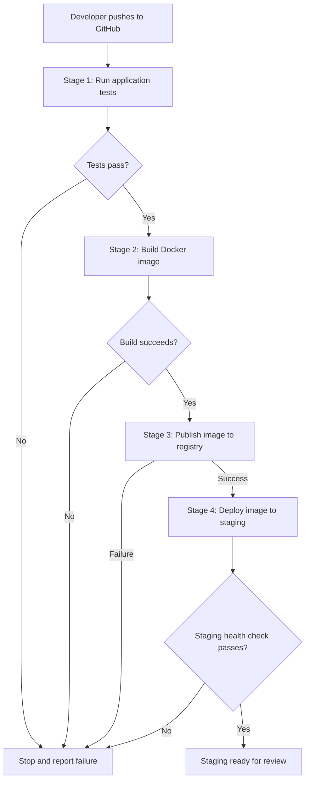

# Day 39 – What is CI/CD?

## Goal

Understand why CI/CD exists, how its parts fit together, and how code moves from GitHub to a staging server. Today focuses on concepts and a diagram; no pipeline implementation is required.

## Task 1: The Problem with Manual Deployment

### What can go wrong with five developers sharing a repository?

- Changes can conflict or break features when combined.
- Untested code can reach production.
- Developers may deploy the wrong commit or overwrite another deployment.
- Missing dependencies, environment variables, or database changes can break the app.
- Manual steps can be skipped, making releases inconsistent and rollback difficult.

### What does “it works on my machine” mean?

The app runs on a developer’s computer but fails elsewhere because the environments differ—for example, different Node.js versions, dependencies, configuration, or database schemas. Repeatable builds and consistent environments reduce these differences; Docker helps package the app and its dependencies.

### How often can a team safely deploy manually?

There is **no fixed safe number of deployments per day**. It depends on the application, testing, coordination, and rollback process. Manual deployment takes time and attention, making frequent releases harder to repeat reliably.

## Task 2: CI vs CD

### Continuous Integration (CI)

Developers integrate small changes into a shared branch frequently, usually at least daily. Automated builds and tests run on changes to detect build failures, regressions, and integration problems early.

**Practical example:** A developer changes an e-commerce login API. Pull-request checks run the tests and reveal that the change breaks an existing login scenario before it is merged.

### Continuous Delivery

Continuous Delivery extends CI by automatically preparing and validating a release so it is ready for production. Deployment to production remains an explicit human decision, often through an approval gate.

**Practical example:** A tested Docker image is deployed to staging. After reviewing the checkout flow, the team approves deploying that same image to production.

### Continuous Deployment

Every change that passes the required checks is automatically deployed to production without a manual approval step. Teams use it when reliable tests, monitoring, and recovery processes support frequent releases.

**Practical example:** A small product-page fix passes automated checks and is released to customers automatically.

| Practice | Main outcome | Production release |
| --- | --- | --- |
| Continuous Integration | Changes are integrated and checked frequently | Outside CI’s scope |
| Continuous Delivery | A validated release is ready to deploy | Human decision |
| Continuous Deployment | Validated changes reach production automatically | Automated |

Definitions: [AWS CI overview](https://aws.amazon.com/devops/continuous-integration/) and [AWS Continuous Delivery overview](https://aws.amazon.com/devops/continuous-delivery/).

## Task 3: Pipeline Anatomy

| Part | What it does | Example |
| --- | --- | --- |
| Trigger | Starts a pipeline run | Push, pull request, schedule, or manual run |
| Stage | Groups work into a logical phase | Test, build, or deploy |
| Job | Groups steps executed on a runner | Build the Docker image |
| Step | Performs one command or reusable action | Check out the source code |
| Runner | Provides the machine that executes a job | A GitHub-hosted Ubuntu runner |
| Artifact | Stores an output produced by a job | Test report, application package, or Docker image |

**GitHub Actions note:** A workflow contains jobs and steps. “Stage” is a conceptual grouping, not a top-level GitHub Actions YAML keyword. Job dependencies can enforce the required order. Docker images are normally published to a container registry; reports can be uploaded as workflow artifacts.

Reference: [Understanding GitHub Actions](https://docs.github.com/en/actions/get-started/understand-github-actions).

## Task 4: Pipeline Diagram

**Scenario:** A developer pushes code to GitHub. The app is tested, packaged as a Docker image, and deployed to staging.

1. **Test:** Check out the code, install dependencies, and run automated tests.
2. **Build:** Create a Docker image from the tested revision and tag it with the commit identifier.
3. **Publish:** Push the image to Docker Hub or another container registry.
4. **Deploy:** Pull that image on the staging server, start the application, and check its health.

This diagram ends at **staging**. Automatic staging deployment alone does not mean Continuous Deployment, which refers to automatic production deployment.

## Task 5: Explore a Real Open-Source Workflow

**Repository:** [fastapi/fastapi](https://github.com/fastapi/fastapi)  
**Folder:** [.github/workflows](https://github.com/fastapi/fastapi/tree/master/.github/workflows)  
**File inspected:** [build-docs.yml](https://github.com/fastapi/fastapi/blob/master/.github/workflows/build-docs.yml)  
**Review date:** September 7, 2026

### What triggers it?

- Pushes to the `master` branch.
- Pull-request events; without specified activity types, the default includes opening, reopening, and updating a pull request.

### How many jobs does it have?

The inspected file defines **four jobs**:

| Job | Purpose |
| --- | --- |
| `changes` | Detects changes to documentation-related files |
| `langs` | Determines which documentation languages to build |
| `build-docs` | Builds documentation per language and uploads the generated site files |
| `docs-all-green` | Combines job outcomes into a check used for branch protection |

The language matrix creates multiple executions of `build-docs`, so actual job runs can exceed four. Documentation work is conditional on relevant changes.

### What does it do?

**Interpretation:** It checks that relevant changes can produce the documentation site and preserves the output as artifacts. This file builds documentation; it does not itself deploy the application to production.

Workflow files can change, so the observations describe the version inspected on the review date.

## Key Takeaways

- CI provides early feedback on integrated changes.
- Continuous Delivery keeps releases ready for a production decision.
- Continuous Deployment automates that production release.
- Pipelines make repeated checks and deployment steps more consistent.
- Good tests, environment configuration, and recovery processes still matter.

---

**Challenge filename:** Save this content as `day-39-cicd-concepts.md` if submitting under the exact expected filename. The Mermaid diagram renders directly on GitHub.
