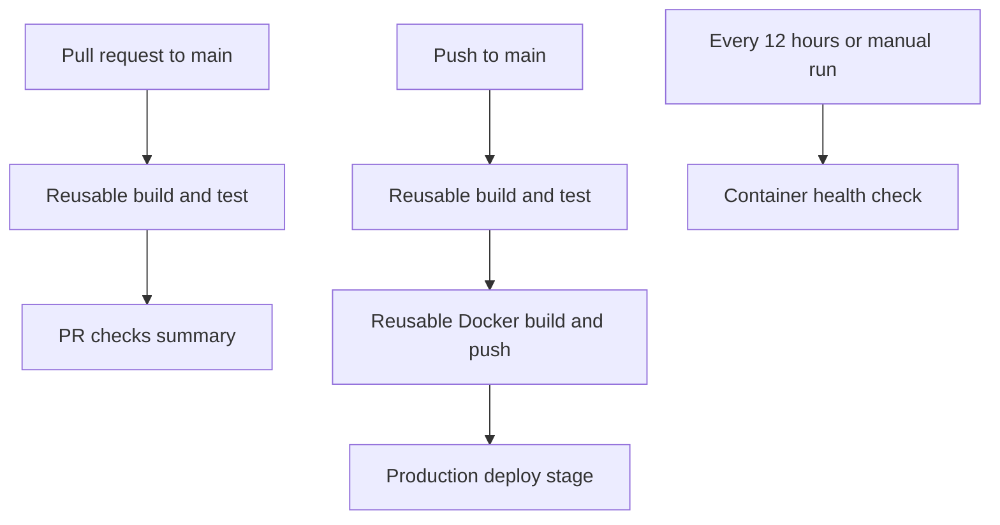

# Day 48 - GitHub Actions Capstone: End-to-End CI/CD Pipeline

This day's challenge brings together the GitHub Actions concepts from Days 40-47: events, jobs, secrets, reusable workflows, Docker publishing, environments, and scheduled runs.

## Goal

Build a small application with a test and a Dockerfile, then connect four workflows so that pull requests run checks, pushes to `main` publish an image and reach a production deployment stage, and a schedule checks the published image.

## Expected deliverables

- A repository such as `github-actions-capstone` or `github-actions-practice`, containing the app, a `Dockerfile`, and at least one test.
- Reusable build/test and Docker publishing workflows.
- Separate pull request, main branch, and scheduled health check workflows.
- Workflow status badges, a pipeline screenshot, and notes in `day-48-actions-project.md`.

## Pipeline at a glance



The pull request path checks code without publishing an image. The main branch path runs tests before publishing. The health check runs separately on a schedule or by manual request.

## 1. Prepare the application

Create a small Flask/FastAPI or Express application with one endpoint, or reuse the Dockerized Day 36 application. Add:

- A `Dockerfile` that starts the app.
- A basic automated test, such as a health endpoint check.
- A project description in the repository's main `README.md`.

Decide on the app's port and health path before writing the health check workflow so its `docker run` and `curl` commands match the application.

## 2. Reusable build and test workflow

Create `.github/workflows/reusable-build-test.yml` with a `workflow_call` trigger. Accept a runtime version (`python_version` or `node_version`) and a boolean `run_tests` input with a default of `true`.

The called workflow should check out the repository, set up the runtime, install dependencies, and run tests when `run_tests` is true. Expose `test_result` as a workflow output with `passed` or `failed` according to the test result. This workflow is for building and testing only.

## 3. Reusable Docker workflow

Create `.github/workflows/reusable-docker.yml` with a `workflow_call` trigger. Accept `image_name` and `tag` inputs and the `docker_username` and `docker_token` secrets.

Check out the code, log in to Docker Hub, build and push the image, and expose the full image path as `image_url`. Configure the caller and the reusable workflow so the desired tags are actually published: `latest` and `sha-<short-commit-hash>`.

## 4. Pull request pipeline

Create `.github/workflows/pr-pipeline.yml`. Trigger it for pull requests targeting `main` with the `opened` and `synchronize` activity types. Call the reusable build/test workflow with tests enabled. After checks pass, run a `pr-comment` job that prints `PR checks passed for branch: <branch>`.

**Verify:** Open or update a pull request and check that tests run. This path should not build or push a Docker image.

## 5. Main branch pipeline

Create `.github/workflows/main-pipeline.yml`, triggered by pushes to `main`:

1. Call the reusable build/test workflow.
2. After tests succeed, call the reusable Docker workflow and publish the `latest` and short SHA tags.
3. After publishing succeeds, run a `deploy` job in the `production` environment. Print `Deploying image: <image_url> to production` using the output from the Docker job.

Set up `production` under **Repository Settings > Environments**. If environment protection rules are enabled, the job may wait for approval.

**Verify:** Merge a pull request, then check that the jobs run in order: tests, Docker publish, deploy stage. Printing the deployment message documents the stage; an actual deployment requires an additional deployment command or action.

## 6. Scheduled health check

Create `.github/workflows/health-check.yml` with both `workflow_dispatch` and this cron schedule:

```yaml
schedule:
  - cron: '0 */12 * * *'
```

Pull the published image, start a container in detached mode, wait for it to initialize, and request its health endpoint. Mark the job failed if the endpoint is unhealthy; stop and remove the container afterward. Write an image name, status, and timestamp to `$GITHUB_STEP_SUMMARY` so each run has a readable report.

**Verify:** Trigger the workflow manually first and confirm that the health endpoint returns a successful response. Scheduled workflows run in UTC.

## 7. Document and review

Add workflow status badges to the repository README and capture a screenshot of the completed pipeline. In `day-48-actions-project.md`, note what worked, any errors you resolved, and what you would add next, such as notifications, multiple environments, or rollback.

## Completion checklist

- [ ] Application, Dockerfile, and basic test are in the repository.
- [ ] Reusable build/test workflow reports its test result.
- [ ] Pull requests run tests without publishing images.
- [ ] Pushes to `main` run tests before publishing both image tags.
- [ ] The production environment job receives the published image URL.
- [ ] Manual health check succeeds; the 12-hour schedule is configured.
- [ ] Workflow badges, pipeline screenshot, and project notes are added.

> This README describes the Day 48 assignment. Check the boxes and add actual run links or screenshots after completing each part.
