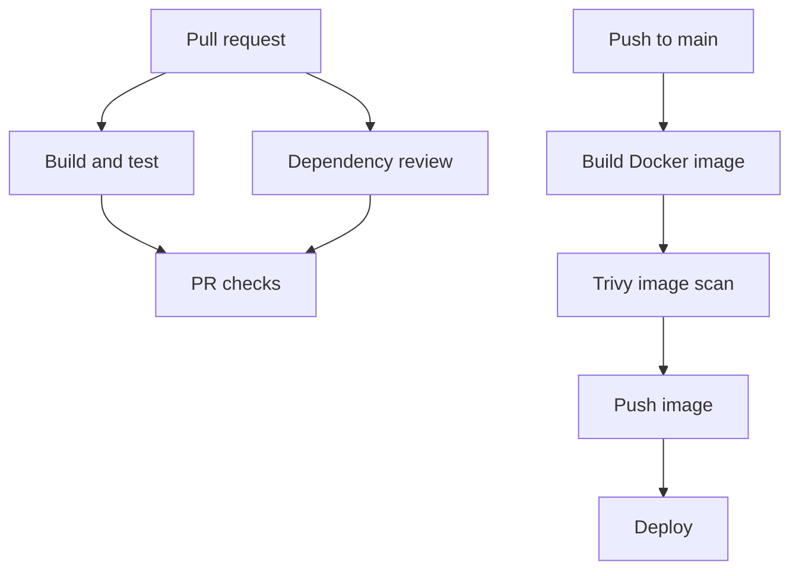

# Day 49 - DevSecOps: Security Checks in CI/CD

Day 49 extends the Day 48 GitHub Actions capstone with automated security checks. The goal is to find risky dependencies, vulnerable container images, and exposed secrets as early as possible.

## Goal

Add security checks to pull requests and the main branch pipeline, configure repository secret protection, and restrict workflow permissions.

## Expected deliverables

- Security checks in the `github-actions-capstone` repository.
- A screenshot of security scan results in GitHub Actions.
- Notes in `day-49-devsecops.md` about scan results and what was learned.

## What DevSecOps means here

The same CI/CD pipeline that builds and tests code also checks it for security problems. A pull request can catch a vulnerable dependency before merge, and an image scan can prevent a vulnerable image from being published or deployed.

The guiding practices are to check early, automate checks, fail on serious findings, keep credentials out of source code, and grant workflows only the permissions they need.

## Secure pipeline flow



GitHub secret scanning runs at the repository level. Push protection, when enabled and available, can block recognized secrets during a push.

## 1. Scan the Docker image with Trivy

Build an image first, scan that same image, and publish it only if the scan passes. The assignment's sample uses `aquasecurity/trivy-action@master` with `format: table`, `exit-code: '1'`, and `severity: 'CRITICAL,HIGH'`. Pin an action to a reviewed release or commit in a real pipeline so its behavior does not change unexpectedly.

Example scan step, placed after the image is built locally:

```yaml
- name: Scan Docker image
  uses: aquasecurity/trivy-action@master
  with:
    image-ref: my-app:ci
    format: table
    exit-code: '1'
    severity: 'CRITICAL,HIGH'
```

Replace `my-app:ci` with the exact local tag built in the previous step. The scan job must fail before the push step if a matching vulnerability is found. If Day 48's reusable Docker workflow currently builds **and pushes** in a single step, split it into build, scan, and push stages before treating the scan as a publication gate. A scan performed after pushing can still block deployment, but it cannot prevent that image from reaching the registry.

**Verify:** Inspect the Trivy table in the Actions logs. Record the base image, detected CVEs if any, severity, and whether the job passed or failed. A passing scan means no findings met the configured failure threshold; it does not prove that an image has no vulnerabilities.

## 2. Enable secret scanning

In the repository's **Settings > Code security and analysis**, enable secret scanning. If the option is available, enable push protection too.

- **Secret scanning** detects supported secret patterns in repository content and alerts on findings.
- **Push protection** attempts to stop a push containing a recognized secret before it enters the repository.

Keep tokens, passwords, and API keys in GitHub Secrets rather than committing them in application code or `.env` files. If a real credential is exposed, revoke or rotate it; removing it from the latest commit alone does not make the old value safe.

**Verify:** Confirm the enabled settings and document the difference between an alert and a blocked push. Do not commit a real key just to test this feature.

## 3. Review pull request dependencies

Add `actions/dependency-review-action@v4` to the PR workflow:

```yaml
- name: Review dependency changes
  uses: actions/dependency-review-action@v4
  with:
    fail-on-severity: critical
```

This reviews dependency changes introduced by the PR and fails at the configured severity threshold. Keep this check in a regular PR job; a job that only calls a reusable workflow cannot also contain normal `steps`. The repository must also support the dependency data the action needs.

**Verify:** Open a PR that changes a supported dependency manifest and confirm the review appears in the PR checks. Record any findings; do not add a known vulnerable package merely for the screenshot.

## 4. Limit workflow permissions

Set permissions explicitly in at least two existing workflows. For workflows that only read repository contents:

```yaml
permissions:
  contents: read
```

Only a job that actually writes to a pull request needs the additional permission:

```yaml
permissions:
  contents: read
  pull-requests: write
```

The Day 48 `pr-comment` task prints a message in its logs, so it does not need `pull-requests: write` unless you change it to post an actual PR comment. Limiting permissions reduces what a compromised action or script can change in the repository.

## 5. Capture the result

In `day-49-devsecops.md`, include:

- A screenshot of the security scan in GitHub Actions.
- The Trivy result: base image, relevant CVEs and severities, and whether the job passed.
- Whether secret scanning and push protection are enabled.
- The dependency review result for a PR with a dependency change.
- Which workflows received explicit permissions.
- A diagram or short description of the final pipeline.

## Completion checklist

- [ ] Docker image is built, scanned, then published only on a passing scan.
- [ ] High and critical findings cause the Trivy gate to fail, if that is the chosen policy.
- [ ] Secret scanning is enabled; push protection is enabled if available.
- [ ] Dependency review runs on relevant pull requests.
- [ ] At least two workflow files declare minimum required permissions.
- [ ] Results and screenshots are recorded in `day-49-devsecops.md`.

> This README describes the Day 49 tasks and implementation choices. Fill in the actual scan results after running the workflows.
