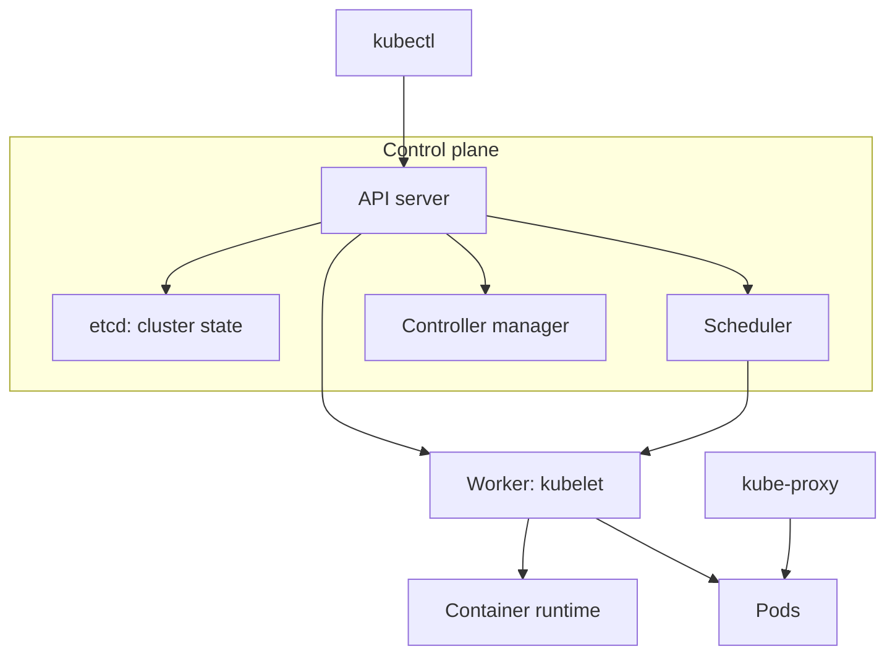

# Day 50 - Kubernetes Architecture and Cluster Setup

Day 50 began my Kubernetes practice. After working with Docker containers, I learned how Kubernetes coordinates containers across nodes, set up a local cluster with kind, and explored its core components using `kubectl`.

## What I learned

Docker runs containers on a host. Kubernetes adds scheduling, desired state, self-healing, service discovery, and scaling across a cluster. Kubernetes originated at Google and was influenced by its earlier cluster management systems, including Borg. The name comes from the Greek word for helmsman or pilot, which explains the helm logo.

## Cluster architecture



| Component | Job |
| --- | --- |
| API server | Accepts and validates requests to the Kubernetes API. |
| etcd | Stores Kubernetes cluster state. |
| Scheduler | Assigns unscheduled Pods to suitable nodes. |
| Controller manager | Runs controllers that reconcile actual and desired state. |
| kubelet | Makes sure assigned Pods and their containers run on its node. |
| Container runtime | Starts and manages containers, such as through containerd. |
| kube-proxy | Implements Service traffic rules on nodes. |

When I run `kubectl apply -f pod.yaml`, `kubectl` sends the manifest to the API server. The API server validates and records the desired state; the scheduler selects a node for the Pod; the kubelet on that node uses the container runtime to start it. Controllers keep watching resources and reconciling the cluster state. `kube-proxy` handles Service traffic rules when Services are involved; it is not the component that starts a Pod.

If the API server becomes unavailable, API requests such as `kubectl get` and `kubectl apply` fail, while already running workloads can continue for a time. If a worker node fails, Pods on that node are unavailable until it recovers or a controller creates replacements on healthy nodes. A standalone Pod is not automatically moved in the same way as a Deployment-managed Pod.

## Tools used

- **kubectl:** Command-line client for the Kubernetes API.
- **kind:** Runs a local Kubernetes cluster using Docker containers as nodes.
- **Docker:** Provides the container environment required by kind.

I chose **kind** for local practice because I could create and recreate a Kubernetes cluster quickly while learning the basic commands.

## 1. Install and verify kubectl

On Linux (amd64), use the official release download command:

```bash
curl -LO "https://dl.k8s.io/release/$(curl -L -s https://dl.k8s.io/release/stable.txt)/bin/linux/amd64/kubectl"
chmod +x kubectl
sudo mv kubectl /usr/local/bin/
kubectl version --client
```

My terminal screenshot shows that the `kubectl` client was installed and responds to `kubectl version --client`.

## 2. Create the kind cluster

With Docker running and kind installed:

```bash
kind create cluster --name devops-cluster
kubectl get nodes
kubectl cluster-info
```

The cluster creation completed and the `devops-cluster-control-plane` node showed **Ready**. kind set my `kubectl` context to `kind-devops-cluster`.

For comparison, the assignment also permits minikube (`minikube start`), but my screenshots document the kind route.

## 3. Explore cluster resources

```bash
kubectl describe node devops-cluster-control-plane
kubectl get namespaces
kubectl get pods -A
kubectl get pods -n kube-system
```

I inspected namespaces and the Pods running in `kube-system`. The output showed components including `etcd`, `kube-apiserver`, `kube-controller-manager`, `kube-scheduler`, CoreDNS, and `kube-proxy`. CoreDNS provides cluster DNS; it is a cluster add-on rather than one of the four control plane components in the architecture table.

## 4. Practice cluster lifecycle and contexts

```bash
kind delete cluster --name devops-cluster
kind create cluster --name devops-cluster
kubectl get nodes
kubectl config current-context
kubectl config get-contexts
kubectl config view
```

After deleting the cluster, `kubectl get nodes` could not connect. Recreating kind restored the cluster and its context. A newly created node may briefly display **NotReady** while startup finishes; run `kubectl get nodes` again to confirm it reaches **Ready**.

A kubeconfig stores cluster connection information, users, and contexts. The usual default path is `~/.kube/config`; `kubectl config current-context` shows which cluster my commands target.

## Screenshot evidence

My Day 50 screenshots, in order, show:

1. Installing and verifying the `kubectl` client.
2. Creating `devops-cluster`, checking node readiness, and viewing cluster info.
3. Exploring namespaces and system Pods.
4. Deleting and recreating the cluster.
5. Inspecting the current context and kubeconfig.

## Key takeaway

A Docker container is one piece of an application. Kubernetes coordinates Pods across cluster nodes and continuously works toward the desired state described through its API. Understanding the control plane, workers, and current kubeconfig context makes later Pod and Deployment work easier to debug.

---

Part of my [90DaysOfDevOps](https://github.com/akverma24400/90DaysOfDevOps/tree/master/2026/day-50) journey.
