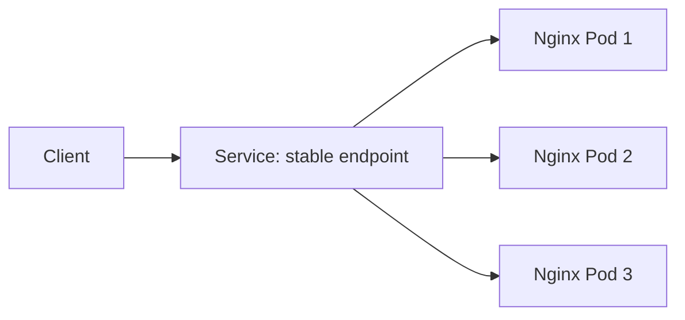

# Day 53 - Kubernetes Services

On Day 53, I learned how Services give a Deployment a stable way to reach its Pods. I deployed three Nginx Pods, tested an internal ClusterIP Service, reached the application through a NodePort, and inspected a LoadBalancer Service in kind.

## Why Services?

A Pod gets its own IP, but that IP can change when the Pod is replaced. A Deployment can also run several Pods at once. A Service selects Pods by label and offers a stable DNS name and virtual IP for the lifetime of the Service, then routes connections to its ready endpoints.



## 1. Deploy the application

Create `app-deployment.yml`:

```yaml
apiVersion: apps/v1
kind: Deployment
metadata:
  name: web-app
  labels:
    app: web-app
spec:
  replicas: 3
  selector:
    matchLabels:
      app: web-app
  template:
    metadata:
      labels:
        app: web-app
    spec:
      containers:
        - name: nginx
          image: nginx:1.25
          ports:
            - containerPort: 80
```

```bash
kubectl apply -f app-deployment.yml
kubectl get pods
kubectl get pods -o wide
```

My screenshot shows three running `web-app` Pods with different Pod IPs, including `10.244.3.3`, `10.244.3.2`, and `10.244.1.2`. I used the actual filename `app-deployment.yml` after an initial attempt with a different filename failed.

## 2. Create and test a ClusterIP Service

A ClusterIP Service is reachable within the cluster. Its selector must match the Pod labels from the Deployment.

```yaml
# clusterip-service.yml
apiVersion: v1
kind: Service
metadata:
  name: web-app-clusterip
spec:
  type: ClusterIP
  selector:
    app: web-app
  ports:
    - port: 80
      targetPort: 80
```

```bash
kubectl apply -f clusterip-service.yml
kubectl get services
kubectl run test-client --image=busybox:latest --rm -it --restart=Never -- sh
# Inside the test Pod:
wget -qO- http://web-app-clusterip
exit
```

The screenshot shows `web-app-clusterip` with a ClusterIP of `10.96.159.109`. A request from the temporary BusyBox Pod returned the Nginx welcome page, confirming the Service was reachable inside the cluster.

`port` is the Service port clients call; `targetPort` is the port on the selected Pods. A Service routes to matching ready endpoints. Repeated calls do not necessarily prove each Pod received a request; response content here is identical across the replicas.

## 3. Service discovery with DNS

A normal Service has a DNS name in the form `<service>.<namespace>.svc.cluster.local`. From a Pod in the same namespace, the short name is usually enough:

```bash
kubectl run dns-test --image=busybox:latest --rm -it --restart=Never -- sh
# Inside the test Pod:
wget -qO- http://web-app-clusterip
wget -qO- http://web-app-clusterip.default.svc.cluster.local
nslookup web-app-clusterip
exit
```

The assignment asks for this DNS comparison. My ClusterIP screenshot confirms that the short Service name resolved from a test Pod; it does not separately show the full DNS lookup or `nslookup` output. The full name assumes the Service is in `default`.

## 4. Expose the application with NodePort

```yaml
# nodeport-service.yml
apiVersion: v1
kind: Service
metadata:
  name: web-app-nodeport
spec:
  type: NodePort
  selector:
    app: web-app
  ports:
    - port: 80
      targetPort: 80
      nodePort: 30080
```

```bash
kubectl apply -f nodeport-service.yml
kubectl get services
kubectl get nodes -o wide
curl http://<reachable-node-ip>:30080
```

A NodePort exposes the Service on the assigned port of the cluster nodes. In my kind environment, `curl http://localhost:30080` from the host did not connect, but `curl http://172.18.0.3:30080` reached the Nginx welcome page. The screenshot shows the node addresses and the successful request. Reachability from another machine depends on the host, Docker networking, and firewall rules; this test used a reachable kind node IP from my environment.

## 5. Inspect a LoadBalancer Service

```yaml
# loadbalancer-service.yml
apiVersion: v1
kind: Service
metadata:
  name: web-app-loadbalancer
spec:
  type: LoadBalancer
  selector:
    app: web-app
  ports:
    - port: 80
      targetPort: 80
```

```bash
kubectl apply -f loadbalancer-service.yml
kubectl get services
kubectl describe service web-app-loadbalancer
```

My screenshot shows the LoadBalancer Service created, with a ClusterIP and a node port, while `EXTERNAL-IP` remained `<pending>`. My kind cluster had no load balancer implementation configured to provision an external address. Cloud integrations or local add-ons can provide one; `<pending>` is expected in this specific setup.

## Compare Service types

| Type | How a client reaches it | Typical use |
| --- | --- | --- |
| ClusterIP | Cluster IP or DNS from inside the cluster | Internal application traffic. |
| NodePort | Reachable node IP and allocated node port | Direct node access and testing. |
| LoadBalancer | Externally provisioned address when an implementation is available | Exposing a Service through a load balancer. |

A LoadBalancer Service commonly receives both a ClusterIP and a node port unless node port allocation is explicitly disabled. My `kubectl get services` output shows ports `80:31174/TCP` for the LoadBalancer Service and `80:30080/TCP` for the NodePort Service.

## 6. Clean up

```bash
kubectl delete -f app-deployment.yml
kubectl delete -f clusterip-service.yml
kubectl delete -f nodeport-service.yml
kubectl delete -f loadbalancer-service.yml
kubectl get pods
kubectl get services
```

After deleting my example resources, only the built-in `kubernetes` Service should remain in the default namespace. The screenshots provided for this day show creation and access; they do not show the final cleanup command output.

## Screenshot evidence

1. Three running Pods from the `web-app` Deployment and their different Pod IPs.
2. ClusterIP Service and a successful in-cluster request.
3. NodePort Service and a successful request through a kind node IP.
4. LoadBalancer Service with an external address still pending.

## Key takeaway

Services separate the way clients reach an application from the changing identities of its Pods. ClusterIP covers internal access, NodePort opens a node port, and LoadBalancer needs a cloud integration or local implementation to provide an external address.

---

Part of my [90DaysOfDevOps](https://github.com/akverma24400/90DaysOfDevOps/tree/master/2026/day-53) journey.
